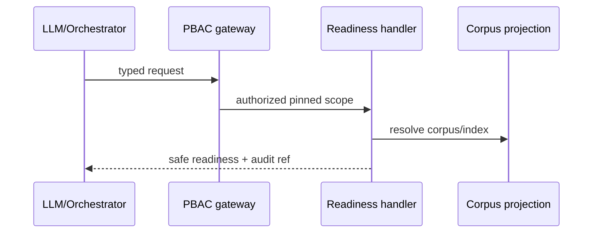

# TASK-AO-5-01 — `get_legal_corpus_readiness`
## 1. Task Information
| Item | Value |
|---|---|
| Story / priority | AO-5 / P0 |
| Exposure / mutation | `LLM_CALLABLE` / `READ` |
| Runtime | worker query handler behind API PBAC/audit gateway |
## 2. Objective
Resolve the active or historically pinned legal corpus and retrieval-index readiness for one assessment. It returns identifiers and gate reasons, never legal text or a legal conclusion.
## 3. Use Cases
An AO-3/AO-5 workflow invokes it before legal retrieval. Missing pin returns `NEEDS_INPUT`; an inactive or failed index returns `BLOCKED`; a ready corpus permits retrieval.
## 4. Tool Definition
| Field | Value |
|---|---|
| Available when | `LEGAL_EVIDENCE_READ` state; PBAC `LEGAL_CORPUS_READ`; assessment scope is valid |
| Data owner / side effect | versioned `CorpusReadinessProjection` / safe audit event only |
| Timeout / retry | 2s; one retry for `PROJECTION_UNAVAILABLE`, otherwise none |
## 5. Input Schema
Shared envelope is required by [shared contract](../shared-tool-contract.md).
| Parameter | Type | Required | Bounds | Example |
|---|---|---:|---|---|
| `effectiveDate` | string | yes | ISO date `YYYY-MM-DD` | `"2026-08-11"` |
| `pinnedCorpusVersionId` | string | no | `^corpus_[A-Za-z0-9_-]{8,80}$` | `"corpus_01J9LEGAL"` |
```json
{"type":"object","additionalProperties":false,"properties":{"effectiveDate":{"type":"string","pattern":"^\\d{4}-\\d{2}-\\d{2}$"},"pinnedCorpusVersionId":{"type":"string","pattern":"^corpus_[A-Za-z0-9_-]{8,80}$"}},"required":["effectiveDate"]}
```
## 6. Output Schema
`result={corpusVersionId,indexVersionId,readiness,effectiveDate,missingRequirements}`; identifiers are capped at one corpus and one index.
```json
{"status":"READY","toolName":"get_legal_corpus_readiness","toolVersion":"1.0.0","configHash":"sha256:legal-readiness-v1","correlationId":"6a66050b-8651-4d66-9fbd-7af8d0d4e310","artifactVersions":{"corpusVersionId":"corpus_01J9LEGAL","retrievalIndexId":"index_01J9LEGAL"},"provenanceRef":"prov:corpus-readiness:01J9","coverageState":"SUFFICIENT","evidenceRefs":["corpus:corpus_01J9LEGAL"],"limitations":[],"result":{"corpusVersionId":"corpus_01J9LEGAL","indexVersionId":"index_01J9LEGAL","readiness":"READY","effectiveDate":"2026-08-11","missingRequirements":[]}}
```
Limited example: `{"status":"BLOCKED","coverageState":"OUT_OF_COVERAGE","result":{"readiness":"INDEX_INVALID","missingRequirements":["VALID_RETRIEVAL_INDEX"]},"evidenceRefs":[],"limitations":[{"code":"INDEX_VALIDATION_FAILED","retryable":false}]}`.
## 7. Error Codes and Typed Outcomes
`INVALID_ARGUMENT` rejects malformed dates/IDs; `NEEDS_INPUT` means pin is absent where historical replay requires it; `NOT_FOUND` is an exhaustive no-corpus lookup; `BLOCKED` covers PBAC, inactive or invalid index; `FAILED`/`TOOL_TIMEOUT` retry only `PROJECTION_UNAVAILABLE`. No status permits invented legal coverage.
## 8. Tool Calling Flow

## 9. Business Rules
Historical workflow pins win; otherwise choose only active, validated corpus effective on the requested date. Cross-tenant IDs, draft/superseded corpus, and unvalidated index fail closed. Empty is not `OUT_OF_COVERAGE` unless a limitation is recorded.
## 10. Execution Logic
`validate → registry allow-list → PBAC/assessment/version check → resolve pinned-or-active projection → verify index/effective date → normalize typed result → privacy scan → audit hash → respond`. Build `LegalCorpusReadinessTool` and `CorpusReadinessProjectionRepository`.
## 11. LLM Tool Definition and Context Contract
Expose strict function `get_legal_corpus_readiness` with the schema in §5. Model sees envelope, IDs, readiness and safe limitation codes only (max 2 KB); may next call `retrieve_legal_basis` only when `READY`; cannot activate or inspect corpus content. Persist prompt-template version and output hash, never prompt text.
## 12. Tool Registry
| Field | Value |
|---|---|
| Handler / action | `LegalCorpusReadinessTool` / `LEGAL_CORPUS_READ` |
| Caller / artifacts | LLM via allow-list / assessment + optional corpus pin |
| Ceiling / idempotency | one corpus lookup; 2s; read-only |
## 13–15. Audit, Retry, Security
Audit request/workflow/assessment/org/actor, tool/version/config, argument hash, status/duration, corpus/provenance/output hashes and correlation ID. Redact all corpus text, URLs, secrets and stack traces. Enforce tenant + PBAC + workflow state at gateway; worker reads only sanitized projection, never object storage. Retry once with exponential 200ms backoff for projection outage; then emit terminal `FAILED` and operator signal.
## 16. Scenario
For a replay dated `2026-08-11`, call `{"effectiveDate":"2026-08-11","pinnedCorpusVersionId":"corpus_01J9LEGAL"}`; `READY` permits bounded basis retrieval. `INDEX_INVALID` blocks the workflow without asking the LLM to infer a rule.
## 17. Acceptance Criteria
Given an authorized valid pin, return stable readiness and refs. Given extra/invalid fields, reject before handler. Given stale/cross-tenant/inactive versions, block and audit. Given an index failure, return explicit limitation without document leakage.
## 18. Test Matrix
| ID | Scenario | Level | Evidence |
|---|---|---|---|
| TC-01 | active and historical pin | contract/integration | stable schema and selection |
| TC-02 | malformed/extra input | contract | no dispatch |
| TC-03 | PBAC/tenant/stale pin | integration | fail closed + audit |
| TC-04 | invalid index/timeout | worker | blocked/retry policy |
| TC-05 | text/URL injected into projection | privacy | payload rejected |
## 19. Definition of Done
Registry, strict schema, projection/handler, normalizer, PBAC/audit/privacy and the matrix pass.
## 20. Technical Notes and Files
Add contracts in `packages/contracts/src/agentic-evidence`; worker projection/handler under `deepagents/tools/common/agentic_evidence`; gateway/audit seam under `apps/api/src/modules/evidence`. Authority: tool catalog, AO-5 story, legal source spec.
## 21. Open Questions
| ID | Question | Owner | Status | Blocks |
|---|---|---|---|---|
| OQ-01 | Ratify 2s timeout and 2KB model cap | Tech Lead | OPEN | yes |
## 22. Deliverables
Strict definition, registry, projection query, handler, safe normalizer, audit/PBAC integration and tests.
