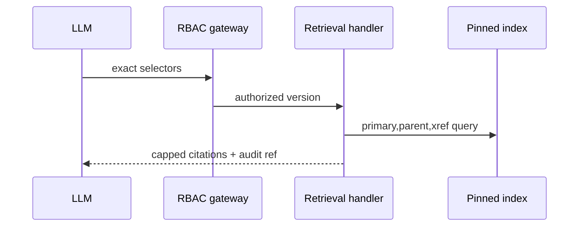

# TASK-AO-5-02 — `retrieve_legal_basis`
## 1. Task Information
| Item | Value |
|---|---|
| Story / priority | AO-5 / P0 |
| Exposure / mutation | `LLM_CALLABLE` / `READ` |
| Runtime | worker retrieval handler behind RBAC/audit gateway |
## 2. Objective
Retrieve a bounded, citation-safe primary clause with its parent and one-hop reference from a pinned validated corpus; it does not answer a legal question or return a document.
## 3. Use Cases
After readiness is `READY`, an AO-5 agent requests exact rule/chunk selectors. Invalid selectors are rejected; no exact clause is `NOT_FOUND`; corpus limitation is `OUT_OF_COVERAGE`.
## 4. Tool Definition
| Field | Value |
|---|---|
| Available when | validated corpus/index pin; `LEGAL_CORPUS_READ` |
| Data owner / side effect | sanitized `LegalRetrievalProjection` / audit only |
| Timeout / retry | 4s; one `INDEX_TEMPORARY_UNAVAILABLE` retry |
## 5. Input Schema
| Parameter | Type | Required | Bounds | Example |
|---|---|---:|---|---|
| `corpusVersionId` | string | yes | corpus ID pattern | `"corpus_01J9LEGAL"` |
| `selectors` | object | yes | 1–5 exact stable IDs; no free-text | `{"ruleIds":["rule_01J9A"]}` |
| `includeContext` | boolean | yes | parent + one-hop only | `true` |
```json
{"type":"object","additionalProperties":false,"properties":{"corpusVersionId":{"type":"string","pattern":"^corpus_[A-Za-z0-9_-]{8,80}$"},"selectors":{"type":"object","additionalProperties":false,"properties":{"ruleIds":{"type":"array","items":{"type":"string","pattern":"^rule_[A-Za-z0-9_-]{6,80}$"},"minItems":1,"maxItems":5,"uniqueItems":true},"chunkIds":{"type":"array","items":{"type":"string","pattern":"^chunk_[A-Za-z0-9_-]{6,80}$"},"maxItems":5,"uniqueItems":true}},"minProperties":1},"includeContext":{"type":"boolean"}},"required":["corpusVersionId","selectors","includeContext"]}
```
## 6. Output Schema
`result={citations:[{chunkId,locator,contextRole,effectiveStatus,excerpt,contentHash}],nextCursor:null}`; max 15 citations and each `excerpt` max 800 characters.
```json
{"status":"READY","toolName":"retrieve_legal_basis","toolVersion":"1.0.0","configHash":"sha256:structure-retrieval-v1","correlationId":"3b8be00a-0624-4091-b96a-cb5691dd5c7b","artifactVersions":{"corpusVersionId":"corpus_01J9LEGAL","indexVersionId":"index_01J9LEGAL"},"provenanceRef":"prov:retrieval:01J9","coverageState":"SUFFICIENT","evidenceRefs":["citation:chunk_01J9A"],"limitations":[],"result":{"citations":[{"chunkId":"chunk_01J9A","locator":"Article 12(1)","contextRole":"PRIMARY","effectiveStatus":"EFFECTIVE","excerpt":"A bounded approved clause excerpt.","contentHash":"sha256:clausehash"}],"nextCursor":null}}
```
Limited result uses `OUT_OF_COVERAGE` with `NO_EFFECTIVE_CHUNK_FOR_SELECTOR`, never an invented excerpt.
## 7. Error Codes and Typed Outcomes
`INVALID_ARGUMENT` forbids arbitrary query/URL; `NEEDS_INPUT` requires a validated pin; `NOT_FOUND` is exhaustive exact selector miss; `OUT_OF_COVERAGE` records corpus/date limitation; `BLOCKED` covers RBAC/index/status; transient index timeout retries once then `FAILED`.
## 8. Tool Calling Flow

## 9. Business Rules
Only exact stable IDs; structure-first primary, parent, then one-hop xref; exclude repealed/non-effective chunks for date; sort primary/parent/xref then locator; no dense free-text search, arbitrary corpus version, more than 15 excerpts, or legal conclusion.
## 10. Execution Logic
`validate → allow-list/RBAC/version → index readiness → exact retrieve → effect-status filter → attach parent/xref → cap/sort → redact → provenance/audit → response`. Build `LegalBasisRetrievalTool` over version-scoped retrieval index.
## 11. LLM Tool Definition and Context Contract
Expose strict function with §5 schema. Model gets max 12 KB citations/locators/hashes and may call `get_legal_rule_match` or `validate_citation_set`; it must cite refs and cannot treat excerpts as full corpus or final advice. Store template version/output hash only.
## 12. Tool Registry
`LegalBasisRetrievalTool`, action `LEGAL_CORPUS_READ`, callers LLM allow-list/AO-3, artifacts corpus/index IDs, 4s/one retry, read-only.
## 13–15. Audit, Retry, Security
Log shared safe fields plus selector hash, selected IDs and cap use; never log raw query, corpus object, URL, OCR text beyond approved excerpts, secrets or traces. Gateway enforces tenant/state/action and index pin; worker reads sanitized index. Retry one 250ms transient index attempt; no retry for denial/validation/not-found.
## 16. Scenario
The agent requests rule `rule_01J9A`; it receives Article 12 primary and allowed context, then validates those citation refs. A repealed clause yields explicit `OUT_OF_COVERAGE`, not a substitute rule.
## 17. Acceptance Criteria
Exact authorized selectors return stable capped citations; extra/free-text input dispatches nowhere; effect filtering distinguishes miss from coverage limits; RBAC denies safely; excerpts never exceed caps or expose full documents.
## 18. Test Matrix
| ID | Scenario | Level | Evidence |
|---|---|---|---|
| TC-01 | primary + parent + xref | integration | ordered bounded citations |
| TC-02 | free-text/extra selector | contract | rejection |
| TC-03 | repealed/date/index mismatch | integration | typed limitation/block |
| TC-04 | tenant/RBAC denial | integration | audit |
| TC-05 | overlong text/document field | privacy | response blocked |
| TC-06 | index outage | worker | one retry/failed audit |
## 19. Definition of Done
Implement strict registry/handler/index adapter/normalizer, redaction/audit and all tests.
## 20. Technical Notes and Files
Contracts `packages/contracts/src/evidence`; worker retrieval under `deepagents/tools/legal/legal`; API evidence gateway. Authority: AO-5, tool catalog, legal source spec.
## 21. Open Questions
| ID | Question | Owner | Status | Blocks |
|---|---|---|---|---|
| OQ-01 | Ratify 15 citations/800-char excerpt cap | Legal + Tech Lead | OPEN | yes |
## 22. Deliverables
Registry definition, strict schema, pinned index adapter, response normalizer, audit/RBAC and tests.
