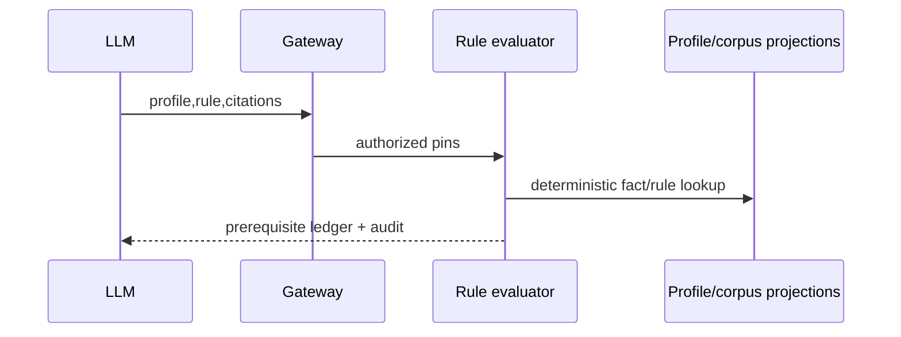

# TASK-AO-5-03 — `get_legal_rule_match`
## 1. Task Information
| Item | Value |
|---|---|
| Story / priority | AO-5 / P0 |
| Exposure / mutation | `LLM_CALLABLE` / `READ` |
| Runtime | deterministic legal-rule evaluator |
## 2. Objective
Return applicability prerequisites, evidence-backed facts and citation allowlist for a rule; never issue a final legal conclusion.
## 3. Use Cases
AO-5 invokes after basis retrieval to learn required/missing/unknown facts. Missing profile/match input is `NEEDS_INPUT`; conflict or insufficient coverage is preserved.
## 4. Tool Definition
| Field | Value |
|---|---|
| Available when | validated profile, corpus/rule pins; `LEGAL_RULE_MATCH_READ` |
| Owner / side effect | immutable `RuleMatchProjection` / audit only |
| Timeout / retry | 3s; one transient projection retry |
## 5. Input Schema
| Parameter | Type | Required | Bounds | Example |
|---|---|---:|---|---|
| `verifiedProfileId` | string | yes | stable ID | `"profile_01J9A"` |
| `ruleId` | string | yes | stable rule ID | `"rule_01J9A"` |
| `citationRefs` | string[] | yes | 1–15 approved citation refs | `["citation:chunk_01J9A"]` |
```json
{"type":"object","additionalProperties":false,"properties":{"verifiedProfileId":{"type":"string","pattern":"^profile_[A-Za-z0-9_-]{8,80}$"},"ruleId":{"type":"string","pattern":"^rule_[A-Za-z0-9_-]{6,80}$"},"citationRefs":{"type":"array","items":{"type":"string","pattern":"^citation:chunk_[A-Za-z0-9_-]{6,80}$"},"minItems":1,"maxItems":15,"uniqueItems":true}},"required":["verifiedProfileId","ruleId","citationRefs"]}
```
## 6. Output Schema
`result={ruleId,applicability,requiredFacts,knownFacts,missingFacts,unknownFacts,allowedCitationRefs}`; each list max 30 and contains IDs/statuses, never profile source text.
```json
{"status":"READY","toolName":"get_legal_rule_match","toolVersion":"1.0.0","configHash":"sha256:rule-match-v1","correlationId":"7ee8c969-5a66-456a-a8c3-af9060502a24","artifactVersions":{"profileId":"profile_01J9A","ruleId":"rule_01J9A"},"provenanceRef":"prov:rule-match:01J9","coverageState":"SUFFICIENT","evidenceRefs":["citation:chunk_01J9A","evidence:fact_01J9"],"limitations":[],"result":{"ruleId":"rule_01J9A","applicability":"CONDITIONAL","requiredFacts":["fact:workforce_size"],"knownFacts":[],"missingFacts":["fact:workforce_size"],"unknownFacts":[],"allowedCitationRefs":["citation:chunk_01J9A"]}}
```
## 7. Error Codes and Typed Outcomes
`INVALID_ARGUMENT`, `NEEDS_INPUT` for absent verified facts, `CONFLICT` for contradictory facts, `OUT_OF_COVERAGE` for a limited fact/corpus, `BLOCKED` for PBAC/version, and transient `FAILED` are normalized; LLM must not replace any of these with applicability.
## 8. Tool Calling Flow

## 9. Business Rules
Use only verified immutable profile facts and validated effective rule/citation versions; unknown/low-confidence material fact remains unknown; sort fact IDs; cap 30; rule evaluator does not call an LLM.
## 10. Execution Logic
`validate → allow-list/PBAC/pin check → validate citation allowlist → load rule + verified facts → evaluate prerequisites/conflicts/coverage → normalize → privacy gate → audit`. Build `LegalRuleMatchTool`/`RuleMatchEvaluator`.
## 11. LLM Tool Definition and Context Contract
Strict §5 schema; max 8KB ledger. The model may request allowed missing input via AO-3 or validate citations; it may not assert applicability/final classification beyond returned state. Prompt version/output hash are audit metadata.
## 12. Tool Registry
Handler `LegalRuleMatchTool`; action `LEGAL_RULE_MATCH_READ`; LLM allow-list; profile/rule/citation artifacts; 3s, one transient retry, read-only.
## 13–15. Audit, Retry, Security
Audit IDs, hashes, rule/profile versions, evidence/limitation refs and duration; redact profile contents, legal text, prompts, secrets and traces. Gateway tenant/PBAC/state checks; evaluator accesses read projections only. Retry one 200ms projection outage; otherwise fail terminally.
## 16. Scenario
Rule needs workforce size, but profile has no verified fact: return `CONDITIONAL` with `missingFacts`; orchestrator uses its typed resolver, not a guessed value.
## 17. Acceptance Criteria
Given valid immutable pins, deterministic prerequisite ledger returns; invalid args reject; conflicts/limits remain explicit; citation mismatch blocks; no legal conclusion/raw data leaks.
## 18. Test Matrix
| ID | Scenario | Level | Evidence |
|---|---|---|---|
| TC-01 | known/missing/unknown facts | unit | stable ledger |
| TC-02 | conflict/limited fact | integration | typed state |
| TC-03 | invalid/cross-tenant | contract/integration | no dispatch/deny |
| TC-04 | citation mismatch | integration | block + audit |
| TC-05 | forbidden nested text | privacy | rejection |
## 19. Definition of Done
Strict contract, evaluator, registry, normalizer, PBAC/audit/privacy and tests pass.
## 20. Technical Notes and Files
Add contracts, `legal_rule_match.py` worker service, API gateway/audit and fixtures. Authority: AO-5/SPEC/tool catalog.
## 21. Open Questions
| ID | Question | Owner | Status | Blocks |
|---|---|---|---|---|
| OQ-01 | Ratify material-fact confidence threshold | Legal Policy Owner | OPEN | yes |
## 22. Deliverables
Definition/schema, deterministic evaluator, registry, audit/PBAC, fixtures and tests.
