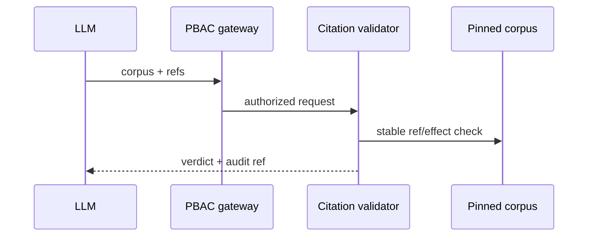

# TASK-AO-5-04 — `validate_citation_set`
## 1. Task Information
AO-5 P0; `LLM_CALLABLE`; `READ`; deterministic worker validator behind API PBAC/audit.
## 2. Objective
Validate that a bounded proposed citation set exists in its pinned corpus, is effective and allow-listed; never interpret law.
## 3. Use Cases
AO-5 validates citations before a proposal gate; absent citation refs are `NEEDS_INPUT`, fabricated/repealed refs yield a failing verdict.
## 4. Tool Definition
Available with corpus/match pins and `LEGAL_CITATION_VALIDATE`; owner `CitationValidationProjection`; side effect audit only; 3s timeout, no retry except one `PROJECTION_UNAVAILABLE` retry.
## 5. Input Schema
| Parameter | Type | Required | Bounds | Example |
|---|---|---:|---|---|
| `corpusVersionId` | string | yes | corpus ID | `"corpus_01J9LEGAL"` |
| `legalRuleMatchId` | string | yes | accepted immutable match ID | `"legal_rule_match_01J9A"` |
| `citationRefs` | string[] | yes | 1–20 stable refs | `["citation:chunk_01J9A"]` |
```json
{"type":"object","additionalProperties":false,"properties":{"corpusVersionId":{"type":"string","pattern":"^corpus_[A-Za-z0-9_-]{8,80}$"},"legalRuleMatchId":{"type":"string","pattern":"^legal_rule_match_[A-Za-z0-9_-]{6,80}$"},"citationRefs":{"type":"array","items":{"type":"string","pattern":"^citation:chunk_[A-Za-z0-9_-]{6,80}$"},"minItems":1,"maxItems":20,"uniqueItems":true}},"required":["corpusVersionId","legalRuleMatchId","citationRefs"]}
```
## 6. Output Schema
`result={valid,items:[{citationRef,validity,reasonCode}],validatedAtVersion}`; max 20, sorted ref.
```json
{"status":"READY","toolName":"validate_citation_set","toolVersion":"1.0.0","configHash":"sha256:citation-validator-v1","correlationId":"d8ae70b8-9c88-45df-bcdf-74d0132ba251","artifactVersions":{"corpusVersionId":"corpus_01J9LEGAL","legalRuleMatchId":"legal_rule_match_01J9A"},"provenanceRef":"prov:citation-validation:01J9","coverageState":"SUFFICIENT","evidenceRefs":["citation:chunk_01J9A"],"limitations":[],"result":{"valid":true,"items":[{"citationRef":"citation:chunk_01J9A","validity":"VALID","reasonCode":null}],"validatedAtVersion":"corpus_01J9LEGAL"}}
```
## 7. Error Codes and Typed Outcomes
`INVALID_ARGUMENT` rejects extra/fabricated formats; `NEEDS_INPUT` missing pin; `NOT_FOUND` valid exhaustive lookup; `OUT_OF_COVERAGE` corpus limitation; `BLOCKED` PBAC/version; `FAILED` transient only. Invalid citation is `READY` with `valid:false`, not a silent failure.
## 8. Tool Calling Flow

## 9. Business Rules
Validate existence, context role, allowlist supplied by the accepted immutable `legalRuleMatchId`, corpus version and effective/repealed status; no arbitrary locators, no mutation; deterministic sort. The match pin is required so an allowlist verdict is deterministic rather than inferred.
## 10. Execution Logic
`validate → allow-list/PBAC/pin → resolve refs → effect/allowlist checks → normalize → privacy check → audit` in `CitationSetValidatorTool`.
## 11. LLM Tool Definition and Context Contract
Strict §5 function, max 5KB response. Model may call proposal validation only after `valid:true`; it cannot replace failed citation or infer an omitted one. Store template version/output hash only.
## 12. Tool Registry
`CitationSetValidatorTool`; `LEGAL_CITATION_VALIDATE`; LLM allow-list; corpus pin; 3s/one transient retry; READ.
## 13–15. Audit, Retry, Security
Log shared safe fields, citation hashes/refs/verdict/duration; redact clause text, URLs, prompts, secrets, stacks. Tenant/state/PBAC checked before worker projection access. Retry one 200ms outage then `FAILED`/operator signal.
## 16. Scenario
Valid chunk returns `VALID`; a repealed ref returns `{valid:false,reasonCode:"REPEALED"}` and proposal gate must not proceed.
## 17. Acceptance Criteria
Stable per-ref verdict; invalid extra input rejects pre-dispatch; repealed/version mismatch differs from coverage limit; denial audits; no legal text leaks.
## 18. Test Matrix
TC-01 valid set; TC-02 malformed/extra; TC-03 fabricated/repealed/version mismatch; TC-04 PBAC/tenant; TC-05 privacy injection; TC-06 transient retry.
## 19. Definition of Done
Registry/schema/validator/normalizer/PBAC/audit/privacy and contract/integration tests pass.
## 20. Technical Notes and Files
`packages/contracts/src/agentic-evidence`; worker `legal_corpus/citation_validator.py`; API evidence gateway/tests. Authority: AO-5/tool catalog.
## 21. Open Questions
OQ-01: Legal owner ratifies context-role policy (`OPEN`, blocks sprint readiness).
## 22. Deliverables
Strict function, registry, validator, audit/PBAC integration and tests.
