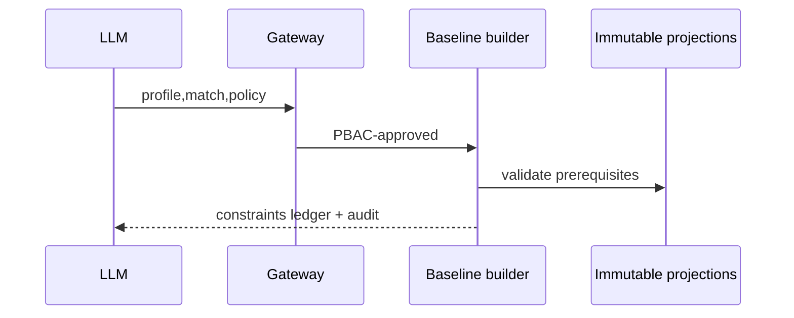

# TASK-AO-5-05 — `get_classification_baseline`
## 1. Task Information
AO-5 P0; `LLM_CALLABLE`; `READ`; deterministic baseline service.
## 2. Objective
Return immutable classification constraints and prerequisite ledger from verified technical/legal/policy versions; not a final classification.
## 3. Use Cases
Agent gets constraints before proposing a label. Missing verified artifacts is `NEEDS_INPUT`; conflict/limited evidence remains typed.
## 4. Tool Definition
Available with verified profile, rule match and policy profile; action `CLASSIFICATION_BASELINE_READ`; owner `ClassificationBaselineProjection`; audit only; 3s/one transient retry.
## 5. Input Schema
| Parameter | Type | Required | Bounds | Example |
|---|---|---:|---|---|
| `verifiedProfileId` | string | yes | profile ID | `"profile_01J9A"` |
| `ruleMatchRef` | string | yes | immutable ref | `"rule-match:01J9A"` |
| `policyProfileVersionId` | string | yes | policy ID | `"policy_01J9A"` |
```json
{"type":"object","additionalProperties":false,"properties":{"verifiedProfileId":{"type":"string","pattern":"^profile_[A-Za-z0-9_-]{8,80}$"},"ruleMatchRef":{"type":"string","pattern":"^rule-match:[A-Za-z0-9_-]{6,80}$"},"policyProfileVersionId":{"type":"string","pattern":"^policy_[A-Za-z0-9_-]{8,80}$"}},"required":["verifiedProfileId","ruleMatchRef","policyProfileVersionId"]}
```
## 6. Output Schema
`result={baselineRef,eligibleLabels,requiredPrerequisites,unmetPrerequisites}`; max 20 IDs each.
```json
{"status":"READY","toolName":"get_classification_baseline","toolVersion":"1.0.0","configHash":"sha256:classification-baseline-v1","correlationId":"0a0f6e55-7153-4367-9d62-25e3921e47a5","artifactVersions":{"profileId":"profile_01J9A","policyProfileVersionId":"policy_01J9A"},"provenanceRef":"prov:baseline:01J9","coverageState":"SUFFICIENT","evidenceRefs":["rule-match:01J9A"],"limitations":[],"result":{"baselineRef":"baseline:01J9A","eligibleLabels":["CLASSIFICATION_CANDIDATE_A"],"requiredPrerequisites":["VALID_CITATIONS"],"unmetPrerequisites":[]}}
```
## 7. Error Codes and Typed Outcomes
`INVALID_ARGUMENT`, `NEEDS_INPUT` missing immutable input, `CONFLICT` contradictory inputs, `OUT_OF_COVERAGE` limited evidence, `BLOCKED` PBAC/stale policy, `FAILED` transient. No baseline authorizes final persistence.
## 8. Tool Calling Flow

## 9. Business Rules
All artifact versions must be immutable/compatible; policy pin controls labels; hard-rule conflicts win; stable ID sort/caps; no LLM inference in builder.
## 10. Execution Logic
`schema → registry/PBAC/version checks → load projections → evaluate hard prerequisites/conflicts → normalize → privacy gate → audit` in `ClassificationBaselineTool`.
## 11. LLM Tool Definition and Context Contract
Strict §5 function; max 6KB ledger; model may call `validate_classification_proposal`, never persist/override baseline. Audit template version/output hash, not prompt.
## 12. Tool Registry
`ClassificationBaselineTool`; `CLASSIFICATION_BASELINE_READ`; LLM allow-list; profile/match/policy refs; 3s/one retry; READ.
## 13–15. Audit, Retry, Security
Audit shared fields/artifact hashes/constraint IDs; no profile source, legal text, prompts or stack traces. Gateway tenant/action/state gate; worker reads projections only. Retry 200ms once for projection outage, then terminal failure.
## 16. Scenario
A fully verified profile returns eligible candidate labels; a citation conflict returns `CONFLICT`, and the orchestrator must resolve it rather than propose.
## 17. Acceptance Criteria
Compatible pins return deterministic ledger; extra args reject; stale policy/conflict/limit are distinct; PBAC fails closed; safe payload only.
## 18. Test Matrix
TC-01 valid pins; TC-02 invalid extra; TC-03 stale/missing/conflict; TC-04 PBAC tenant; TC-05 privacy; TC-06 timeout retry.
## 19. Definition of Done
Contracts, projection/service, registry, normalizer, audit/security and tests pass.
## 20. Technical Notes and Files
Contracts, `classification/baseline.py` worker, API evidence gateway and fixtures. Authority: AO-5/SPEC.
## 21. Open Questions
OQ-01: Policy owner confirms eligible label vocabulary (`OPEN`, blocks readiness).
## 22. Deliverables
Definition/schema, baseline evaluator, gateway/audit and tests.
