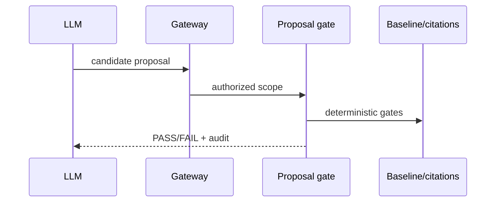

# TASK-AO-5-06 — `validate_classification_proposal`

> Superseded: `validate_classification_proposal` is no longer a canonical runtime tool for active direct EngineeringRule classification.
## 1. Task Information
AO-5 P0; `LLM_CALLABLE`; `READ`; proposal gate, no persistence.
## 2. Objective
Validate a schema-bound classification proposal against an immutable baseline, citations, conflicts and coverage; return a gate verdict only.
## 3. Use Cases
LLM submits allowed candidate label after baseline. Invalid proposal rejects; failed gate stays proposal-only with reasons.
## 4. Tool Definition
Available with baseline/citation refs and `CLASSIFICATION_PROPOSAL_VALIDATE`; owner `ClassificationGate`; audit proposal hash only; 4s/no retry except one transient projection retry.
## 5. Input Schema
| Parameter | Type | Required | Bounds | Example |
|---|---|---:|---|---|
| `baselineRef` | string | yes | baseline ref | `"baseline:01J9A"` |
| `candidateLabel` | string | yes | canonical candidate token | `"CLASSIFICATION_CANDIDATE_A"` |
| `citationRefs` | array | yes | 1–20 refs | `["citation:chunk_01J9A"]` |
```json
{"type":"object","additionalProperties":false,"properties":{"baselineRef":{"type":"string","pattern":"^baseline:[A-Za-z0-9_-]{6,80}$"},"candidateLabel":{"type":"string","pattern":"^CLASSIFICATION_[A-Z0-9_]{3,64}$"},"citationRefs":{"type":"array","items":{"type":"string","pattern":"^citation:chunk_[A-Za-z0-9_-]{6,80}$"},"minItems":1,"maxItems":20,"uniqueItems":true}},"required":["baselineRef","candidateLabel","citationRefs"]}
```
## 6. Output Schema
`result={verdict,violations,allowedNextState}`; violations max 20 code/ref pairs.
```json
{"status":"READY","toolName":"validate_classification_proposal","toolVersion":"1.0.0","configHash":"sha256:classification-gate-v1","correlationId":"fba97ae8-8173-49cc-83e4-23f5c88b25de","artifactVersions":{"baselineRef":"baseline:01J9A"},"provenanceRef":"prov:classification-gate:01J9","coverageState":"SUFFICIENT","evidenceRefs":["citation:chunk_01J9A"],"limitations":[],"result":{"verdict":"PASS","violations":[],"allowedNextState":"PROPOSAL_READY_FOR_INDEPENDENT_REVIEW"}}
```
## 7. Error Codes and Typed Outcomes
`INVALID_ARGUMENT`; `NEEDS_INPUT`; `CONFLICT`; `OUT_OF_COVERAGE`; `BLOCKED`; `FAILED`. Gate `FAIL` is `READY` result, not a final classification and never a mutation.
## 8. Tool Calling Flow

## 9. Business Rules
Candidate must be in baseline eligible labels; validate citation allowlist, hard constraints, conflict/coverage and state. Audit hash only; never create/update final classification.
## 10. Execution Logic
`validate → RBAC/pin → load baseline → validate citations → hard-rule/overclaim/conflict/coverage gates → normalize → privacy/audit` in `ClassificationProposalValidator`.
## 11. LLM Tool Definition and Context Contract
Strict §5 function; max 5KB. On PASS model may submit a proposal to independent workflow, never self-approve; on FAIL it may resolve listed typed requirement only.
## 12. Tool Registry
`ClassificationProposalValidator`; `CLASSIFICATION_PROPOSAL_VALIDATE`; LLM allow-list; baseline/citations; 4s/one transient retry; READ.
## 13–15. Audit, Retry, Security
Log proposal hash, refs, verdict, duration/correlation; redact rationale/free text, prompts, legal text, secrets/stacks. Gateway RBAC/tenant/state; no direct DB/object storage. One 250ms projection retry then failed/DLQ policy.
## 16. Scenario
An eligible label with valid citations returns PASS and `PROPOSAL_READY_FOR_INDEPENDENT_REVIEW`; one unsupported citation returns FAIL without changing any classification.
## 17. Acceptance Criteria
Stable gate verdict, pre-dispatch strict validation, distinct conflict/coverage, denial audit, no final persistence or sensitive payload.
## 18. Test Matrix
TC-01 PASS; TC-02 each gate fail; TC-03 extra input; TC-04 RBAC/stale; TC-05 privacy; TC-06 retry; TC-07 replay no mutation.
## 19. Definition of Done
Strict contract/gates/registry/audit/RBAC and tests pass; persistence test proves no final write.
## 20. Technical Notes and Files
Contracts, `classification/proposal_validator.py`, API gateway/audit, test fixtures. Authority: AO-5.
## 21. Open Questions
OQ-01: Independent review transition owner (`OPEN`, blocks final workflow integration).
## 22. Deliverables
Definition/schema/gate/normalizer/audit and no-mutation tests.
