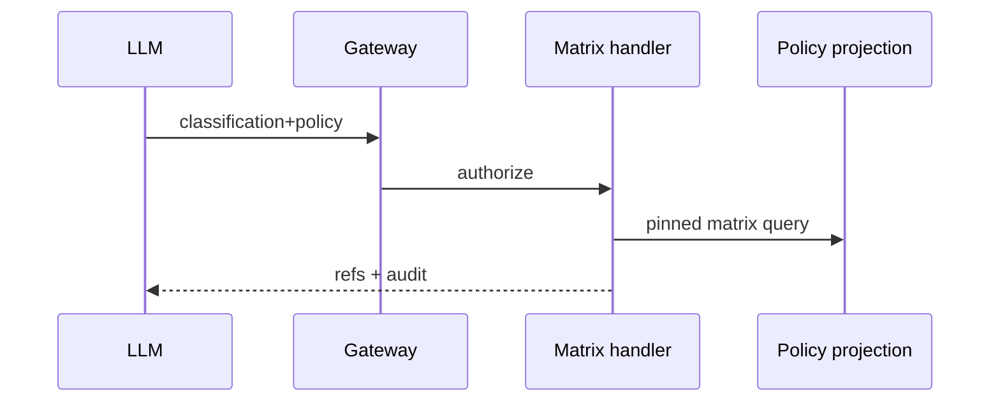

# TASK-AO-5-07 — `get_gap_requirements`
## 1. Task Information
AO-5 P0; `LLM_CALLABLE`; `READ`; worker requirement-matrix query.
## 2. Objective
Return only the pinned requirement matrix eligible for an independently reviewed classification; it cannot create a gap decision.
## 3. Use Cases
AO-5 calls after classification gate/review. Missing or unreviewed classification is `NEEDS_INPUT`/`BLOCKED`.
## 4. Tool Definition
Action `GAP_REQUIREMENTS_READ`; owner immutable `RequirementMatrixProjection`; audit only; 3s and one transient retry.
## 5. Input Schema
| Parameter | Type | Required | Bounds | Example |
|---|---|---:|---|---|
| `classificationRef` | string | yes | reviewed ref | `"classification:01J9A"` |
| `policyProfileVersionId` | string | yes | policy ID | `"policy_01J9A"` |
```json
{"type":"object","additionalProperties":false,"properties":{"classificationRef":{"type":"string","pattern":"^classification:[A-Za-z0-9_-]{6,80}$"},"policyProfileVersionId":{"type":"string","pattern":"^policy_[A-Za-z0-9_-]{8,80}$"}},"required":["classificationRef","policyProfileVersionId"]}
```
## 6. Output Schema
`result={matrixRef,requirements:[{requirementId,locator}],nextCursor}`; 1–100 deterministic IDs.
```json
{"status":"READY","toolName":"get_gap_requirements","toolVersion":"1.0.0","configHash":"sha256:gap-requirements-v1","correlationId":"81d66285-426d-43fc-940b-47a1b57d06af","artifactVersions":{"classificationRef":"classification:01J9A","policyProfileVersionId":"policy_01J9A"},"provenanceRef":"prov:requirements:01J9","coverageState":"SUFFICIENT","evidenceRefs":["requirement:req_01J9A"],"limitations":[],"result":{"matrixRef":"matrix:01J9A","requirements":[{"requirementId":"req_01J9A","locator":"Article 12(1)"}],"nextCursor":null}}
```
## 7. Error Codes and Typed Outcomes
`INVALID_ARGUMENT`, `NEEDS_INPUT`, `NOT_FOUND` exhaustive no requirements, `OUT_OF_COVERAGE` policy limitation, `BLOCKED` PBAC/unreviewed/stale pin, `FAILED` transient.
## 8. Tool Calling Flow

## 9. Business Rules
Require independently reviewed classification, policy pin and tenant match; sort ID/cap 100; no legal text or matrix mutation.
## 10. Execution Logic
Validate, registry/PBAC/version check, resolve eligible matrix, sort/cap, privacy scan/audit; implement `GapRequirementsTool`.
## 11. LLM Tool Definition and Context Contract
Strict §5, max 10KB; model may call `evaluate_gap_matrix`, cannot infer unlisted requirements or edit matrix.
## 12. Tool Registry
`GapRequirementsTool`; `GAP_REQUIREMENTS_READ`; LLM allow-list; classification/policy refs; 3s/one retry/READ.
## 13–15. Audit, Retry, Security
Shared audit hashes/refs/status/duration; redact requirement content beyond approved locator, prompts/secrets/traces. Gateway tenant/PBAC/state; projection only; retry one 200ms transient outage then failed/operator alert.
## 16. Scenario
Reviewed classification yields matrix `matrix:01J9A`; unreviewed candidate blocks, rather than generating obligations.
## 17. Acceptance Criteria
Stable pinned matrix; strict extra-field rejection; unreviewed/stale/PBAC explicit; no legal text leaks.
## 18. Test Matrix
TC-01 valid matrix; TC-02 malformed; TC-03 stale/unreviewed; TC-04 tenant/PBAC; TC-05 privacy; TC-06 timeout.
## 19. Definition of Done
Contract, query, registry, audit/security and tests pass.
## 20. Technical Notes and Files
Contracts; worker `gap/requirements.py`; API gateway/tests; AO-5/tool catalog authority.
## 21. Open Questions
OQ-01: Ratify 100-row cap (Tech Lead, OPEN, blocks readiness).
## 22. Deliverables
Definition/schema/projection handler/normalizer/audit/tests.
