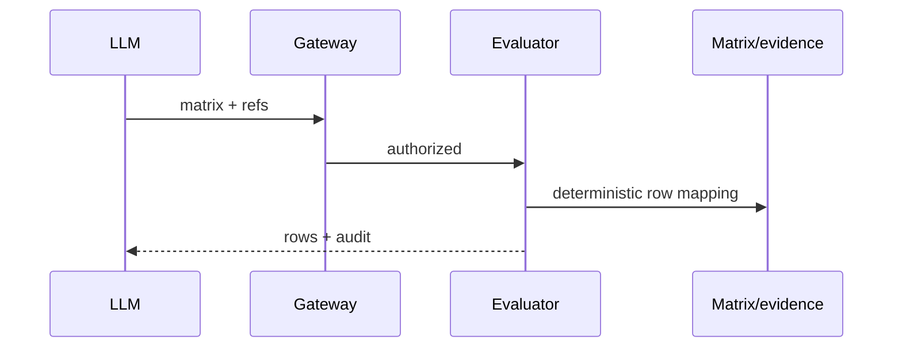

# TASK-AO-5-08 — `evaluate_gap_matrix`
## 1. Task Information
AO-5 P0; `LLM_CALLABLE`; `READ`; deterministic gap evaluator.
## 2. Objective
Evaluate bounded matrix rows against pinned evidence/coverage, producing traceable statuses without closing a gap.
## 3. Use Cases
Agent submits a matrix and evidence refs; evidence conflict/limitation remains `CONTRADICTED`/`OUT_OF_COVERAGE`.
## 4. Tool Definition
Action `GAP_MATRIX_EVALUATE`; immutable `GapEvaluationProjection`; audit only; 5s, one transient retry.
## 5. Input Schema
| Parameter | Type | Required | Bounds | Example |
|---|---|---:|---|---|
| `matrixRef` | string | yes | stable ref | `"matrix:01J9A"` |
| `evidenceRefs` | array | yes | 1–100 refs | `["evidence:fact_01J9"]` |
```json
{"type":"object","additionalProperties":false,"properties":{"matrixRef":{"type":"string","pattern":"^matrix:[A-Za-z0-9_-]{6,80}$"},"evidenceRefs":{"type":"array","items":{"type":"string","pattern":"^(evidence|citation|coverage):[A-Za-z0-9_-]{6,100}$"},"minItems":1,"maxItems":100,"uniqueItems":true}},"required":["matrixRef","evidenceRefs"]}
```
## 6. Output Schema
`result={rows:[{rowRef,status,evidenceRefs,rationaleCode,resolverType}]}`; statuses enum `SATISFIED,MISSING,CONTRADICTED,UNKNOWN,OUT_OF_COVERAGE`, max 100.
```json
{"status":"READY","toolName":"evaluate_gap_matrix","toolVersion":"1.0.0","configHash":"sha256:gap-evaluator-v1","correlationId":"9ec545c8-87f8-4bed-9336-45337b353135","artifactVersions":{"matrixRef":"matrix:01J9A"},"provenanceRef":"prov:gap-eval:01J9","coverageState":"SUFFICIENT","evidenceRefs":["evidence:fact_01J9"],"limitations":[],"result":{"rows":[{"rowRef":"gap-row:01J9A","status":"MISSING","evidenceRefs":[],"rationaleCode":"NO_VERIFIED_EVIDENCE","resolverType":"COLLECT_EVIDENCE"}]}}
```
## 7. Error Codes and Typed Outcomes
`INVALID_ARGUMENT`, `NEEDS_INPUT`, `CONFLICT`, `OUT_OF_COVERAGE`, `BLOCKED`, `FAILED`; row `MISSING` is a valid READY result, never auto-resolved.
## 8. Tool Calling Flow

## 9. Business Rules
Every row gets one canonical status and cited refs; evidence may not self-close a remediation; sort rowRef, cap 100.
## 10. Execution Logic
Validate, PBAC/pin, load matrix/evidence/coverage, evaluate each deterministic rule, normalize/redact/audit in `GapMatrixEvaluator`.
## 11. LLM Tool Definition and Context Contract
Strict §5; max 15KB; model may request trace/remediation candidate only; cannot update row status.
## 12. Tool Registry
`GapMatrixEvaluator`; `GAP_MATRIX_EVALUATE`; LLM allow-list; matrix/evidence refs; 5s/one retry/READ.
## 13–15. Audit, Retry, Security
Audit refs/hash/status/budget; redact rationales/source/prompt/secrets/stacks. Tenant/PBAC/state/pinned projection only. One 300ms transient retry then `FAILED`/DLQ policy.
## 16. Scenario
No verified evidence makes one row `MISSING`; limited scanner coverage makes it `OUT_OF_COVERAGE`, not missing.
## 17. Acceptance Criteria
All five status fixtures deterministic; strict input; explicit conflict/limit; no state write or raw leak.
## 18. Test Matrix
TC-01 five statuses; TC-02 extra input; TC-03 stale/cross tenant; TC-04 PBAC; TC-05 privacy; TC-06 timeout; TC-07 no mutation.
## 19. Definition of Done
Evaluator/registry/schema/audit/security/tests pass.
## 20. Technical Notes and Files
Contracts; `gap/evaluator.py`; gateway/tests; AO-5 authority.
## 21. Open Questions
OQ-01: Row-count 100 cap approval (Tech Lead, OPEN, blocks readiness).
## 22. Deliverables
Strict tool, evaluator, normalizer, audit and test suite.
