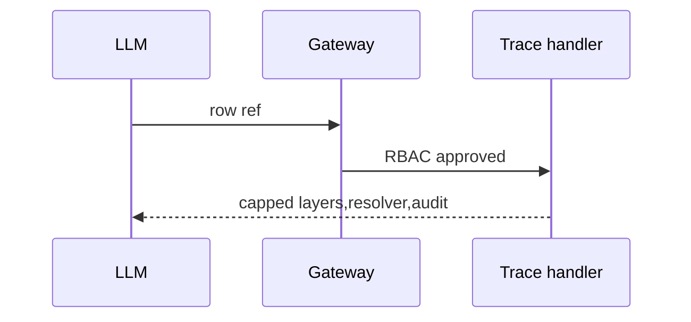

# TASK-AO-5-09 — `get_gap_evidence_trace`
## 1. Task Information
AO-5/P0, `LLM_CALLABLE`, READ, worker trace query.
## 2. Objective
Return bounded provenance layers and allowed resolver for one immutable gap row; never source bodies.
## 3. Use Cases
An evaluator result needs its missing evidence origin; absent row is `NOT_FOUND`, limited provenance is `OUT_OF_COVERAGE`.
## 4. Tool Definition
Action `GAP_TRACE_READ`; `GapTraceProjection`; audit-only; 2s/one transient retry.
## 5. Input Schema
| Parameter | Type | Required | Bounds | Example |
| `rowRef` | string | yes | stable gap row | `gap-row:01J9A` |
```json
{"type":"object","additionalProperties":false,"properties":{"rowRef":{"type":"string","pattern":"^gap-row:[A-Za-z0-9_-]{6,80}$"}},"required":["rowRef"]}
```
## 6. Output Schema
`result={rowRef,layers:[{layer,artifactRef}],resolverType}`; max 8 layers.
```json
{"status":"READY","toolName":"get_gap_evidence_trace","toolVersion":"1.0.0","configHash":"sha256:gap-trace-v1","correlationId":"2d1c8928-7799-4e39-a133-c47a3f842b32","artifactVersions":{"gapRowRef":"gap-row:01J9A"},"provenanceRef":"prov:gap-trace:01J9","coverageState":"SUFFICIENT","evidenceRefs":["evidence:fact_01J9"],"limitations":[],"result":{"rowRef":"gap-row:01J9A","layers":[{"layer":"TECHNICAL_EVIDENCE","artifactRef":"evidence:fact_01J9"}],"resolverType":"COLLECT_EVIDENCE"}}
```
## 7. Error Codes and Typed Outcomes
`INVALID_ARGUMENT`, `NOT_FOUND`, `OUT_OF_COVERAGE`, `BLOCKED` RBAC/tenant, `FAILED` transient; never infer an absent layer.
## 8. Tool Calling Flow

## 9. Business Rules
Follow only immutable row links; tenant match, stable order, no arbitrary graph traversal.
## 10. Execution Logic
Validate→registry/RBAC→projection lookup→cap→privacy/audit→response (`GapTraceTool`).
## 11. LLM Tool Definition and Context Contract
Strict §5, max 3KB; may invoke only returned AO-3 resolver; cannot access artifacts directly.
## 12. Tool Registry
`GapTraceTool`; `GAP_TRACE_READ`; LLM allow-list; 2s/one retry/READ.
## 13–15. Audit, Retry, Security
Audit shared IDs/refs/hash/status; redact content/prompts/secrets/stacks; projection-only worker, tenant/state/RBAC gateway; retry 200ms once then FAILED.
## 16. Scenario
Missing evidence trace returns `COLLECT_EVIDENCE`; model requests that resolver only.
## 17. Acceptance Criteria
Stable trace, strict input, explicit limited/denied result, no source leak.
## 18. Test Matrix
TC valid trace; malformed; missing/limited; RBAC; privacy; timeout.
## 19. Definition of Done
Schema/registry/handler/audit/RBAC/tests pass.
## 20. Technical Notes and Files
Contracts, `gap/trace.py`, API gateway/tests; AO-5 catalog authority.
## 21. Open Questions
OQ-01 resolver vocabulary owner: AO-3 lead, OPEN, blocks readiness.
## 22. Deliverables
Tool definition, projection handler, normalizer, audit/tests.
