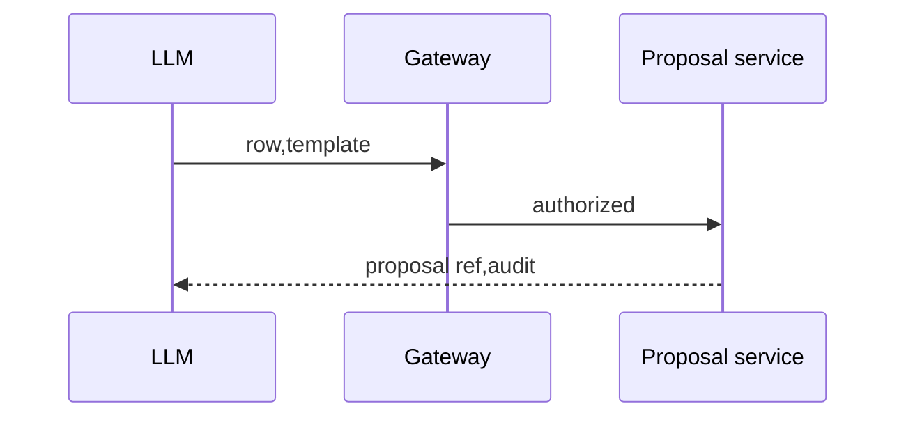

# TASK-AO-5-10 — `propose_gap_remediation`
## 1. Task Information
AO-5/P1, `LLM_CALLABLE`, READ/proposal-only.
## 2. Objective
Create a bounded draft remediation candidate from one pinned gap row; it cannot close or mutate the row.
## 3. Use Cases
After `MISSING`, agent selects approved template; stale row/self-close fails `BLOCKED`.
## 4. Tool Definition
Action `GAP_REMEDIATION_PROPOSE`; `RemediationProposalService`; audit proposal hash; 4s/no retry except one transient projection retry.
## 5. Input Schema
| Parameter | Type | Required | Bounds | Example |
| `rowRef` | string | yes | gap row | `gap-row:01J9A` |
| `templateId` | string | yes | allow-listed | `remediation:collect-evidence` |
```json
{"type":"object","additionalProperties":false,"properties":{"rowRef":{"type":"string","pattern":"^gap-row:[A-Za-z0-9_-]{6,80}$"},"templateId":{"type":"string","enum":["remediation:collect-evidence","remediation:resolve-conflict","remediation:expand-coverage"]}},"required":["rowRef","templateId"]}
```
## 6. Output Schema
`result={proposalRef,rowRef,templateId,requiredIndependentValidation}`.
```json
{"status":"READY","toolName":"propose_gap_remediation","toolVersion":"1.0.0","configHash":"sha256:remediation-v1","correlationId":"f357436a-b72b-4830-9996-6e060d5df61f","artifactVersions":{"gapRowRef":"gap-row:01J9A"},"provenanceRef":"prov:remediation:01J9","coverageState":"SUFFICIENT","evidenceRefs":[],"limitations":[],"result":{"proposalRef":"remediation-proposal:01J9","rowRef":"gap-row:01J9A","templateId":"remediation:collect-evidence","requiredIndependentValidation":true}}
```
## 7. Error Codes and Typed Outcomes
`INVALID_ARGUMENT`, `NEEDS_INPUT`, `BLOCKED` stale/self-close/PBAC, `OUT_OF_COVERAGE`, `FAILED`; no success changes a gap.
## 8. Tool Calling Flow

## 9. Business Rules
Only allow-listed templates; bind proposer run/hash; independent validator required; no update operation.
## 10. Execution Logic
Validate→PBAC/pin→load row→template build→immutable proposal→privacy/audit; `GapRemediationProposalTool`.
## 11. LLM Tool Definition and Context Contract
Strict §5, 3KB; model may submit proposal to independent workflow, never mark satisfied.
## 12. Tool Registry
`GapRemediationProposalTool`; `GAP_REMEDIATION_PROPOSE`; LLM allow-list; 4s/one retry/READ.
## 13–15. Audit, Retry, Security
Audit refs/template/proposer hash; redact rationale/prompts/source/secrets; PBAC/tenant/state and no row-write capability; retry once then failed.
## 16. Scenario
`MISSING` row gets a collect-evidence draft; independent validation is mandatory.
## 17. Acceptance Criteria
Only approved template; no self-close; replay does not mutate; safe audit.
## 18. Test Matrix
Valid proposal; invalid template; stale/self-close; PBAC; privacy; replay.
## 19. Definition of Done
Registry/schema/service/audit/no-mutation tests pass.
## 20. Technical Notes and Files
Contracts, `gap/remediation.py`, gateway/tests; AO-5 authority.
## 21. Open Questions
OQ-01 template catalog owner OPEN, blocks readiness.
## 22. Deliverables
Strict tool, immutable proposal, audit and tests.
