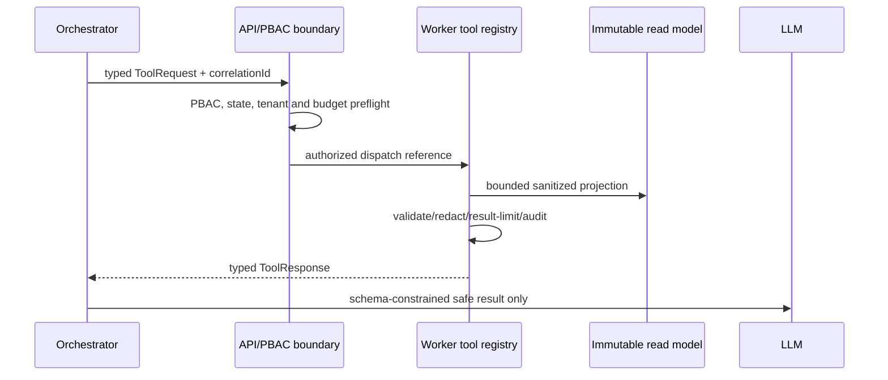

# Shared Agentic Tool Contract

Status: DELIVERED
Applies to: every capability in `docs/specs/spec-agentic-evidence-orchestration/tool-catalog.md`
Primary runtime owner: `deepagents`
Supporting boundary owner: `apps/api` for trusted trigger, PBAC, audit, and immutable artifact persistence

## Purpose

This is the executable contract shared by all 55 agentic capabilities. A per-tool packet may add a typed request extension and result payload, but cannot weaken this contract. It is the LLM-facing boundary: a model receives only the response projection defined here and can never receive repository source, secrets, full prompts, full AST/CST bodies, arbitrary files, shell access, or arbitrary URLs.

## Call Lifecycle



## Shared Request Envelope

Every request is validated before a worker starts. Fields use canonical contract values; a per-tool extension is schema-validated and cannot add a free-text path, URL, query language, shell command, or raw content field.

| Field              | Type / validation                            | Meaning                                                                                |
| ------------------ | -------------------------------------------- | -------------------------------------------------------------------------------------- |
| `toolName`         | registered catalog capability                | Exact allow-listed tool; unknown values are denied.                                    |
| `requestId`        | UUID                                         | Unique audit/trace identity.                                                           |
| `assessmentId`     | UUID                                         | Tenant-scoped assessment authority.                                                    |
| `workflowRunId`    | UUID                                         | Durable orchestration run; required for agent calls.                                   |
| `artifactVersions` | typed refs                                   | Pinned immutable input versions; tool declares required ref types.                     |
| `correlationId`    | UUID                                         | Propagates through queue, audit, and response.                                         |
| `scope`            | typed bounded selector                       | Relative paths, IDs, labels, direction/depth, or corpus IDs allowed by that tool only. |
| `budget`           | `{maxItems,maxDepth,maxBytes,maxDurationMs}` | Positive server-capped limits. Client cannot raise a system maximum.                   |
| `input`            | tool-specific object                         | Validated against the per-tool packet.                                                 |
| `idempotencyKey`   | required only for mutation                   | Stable request identity; required for targeted reanalysis, activation, and resume.     |

### Required Preflight

1. Resolve `assessmentId`, organization, and resource ownership; deny on missing/mismatched scope.
2. Evaluate PBAC with subject, organization, resource, action, runtime context, policy version, and state gate; default deny.
3. Verify every referenced artifact/corpus version is immutable, accessible, and valid for the requested workflow state.
4. Enforce tool allow-list, tool-specific input schema, budget ceiling, and scope selector grammar.
5. For a mutation, reserve or replay the idempotency record before dispatch; emit an audit event for denial, replay, or execution.

## Shared Response Envelope

```json
{
  "status": "READY",
  "toolName": "get_scan_coverage",
  "toolVersion": "1.0.0",
  "configHash": "sha256:...",
  "correlationId": "uuid",
  "artifactVersions": { "technicalEvidenceReportId": "..." },
  "provenanceRef": "prov:...",
  "coverageState": "SUFFICIENT",
  "evidenceRefs": ["evidence:..."],
  "limitations": [],
  "result": {}
}
```

| Field                       | Rule                                                                                                                                                                 |
| --------------------------- | -------------------------------------------------------------------------------------------------------------------------------------------------------------------- |
| `status`                    | `READY`, `NEEDS_INPUT`, `CONFLICT`, `OUT_OF_COVERAGE`, `BLOCKED`, or `FAILED`. A domain result may have its own bounded value set, but does not replace tool status. |
| `toolVersion`, `configHash` | Required for every response, including limited/failed responses when tool started.                                                                                   |
| `artifactVersions`          | Echoes only safe immutable version IDs/hashes used to produce the result.                                                                                            |
| `provenanceRef`             | Required safe reference to tool execution/provenance record.                                                                                                         |
| `coverageState`             | `SUFFICIENT`, `PARTIAL`, `LIMITED`, or `UNAVAILABLE`; never implied from an empty result.                                                                            |
| `evidenceRefs`              | Stable IDs/hashes/relative locators only; maximum controlled by `budget.maxItems`.                                                                                   |
| `limitations`               | Typed `{code, affectedScopeRef, reason, retryable}` records; no stack trace or raw input.                                                                            |
| `result`                    | Tool-specific safe schema in its packet.                                                                                                                             |

## Shared Error and Resolver Mapping

| Condition                                                         | Status            | Required limitation / next action                        |
| ----------------------------------------------------------------- | ----------------- | -------------------------------------------------------- |
| Valid request, no matching evidence, sufficient scope             | `READY`           | Tool-specific empty/not-found result.                    |
| Missing required artifact/input                                   | `NEEDS_INPUT`     | Typed requirement and permitted resolver ref.            |
| Incomplete scanner/corpus coverage                                | `OUT_OF_COVERAGE` | Affected scope and known limitation IDs.                 |
| Evidence/material state conflict                                  | `CONFLICT`        | Conflict refs; no automatic resolution.                  |
| PBAC denial, inactive corpus, exhausted retry, invalid transition | `BLOCKED`         | Safe block reason and audit ref.                         |
| Unexpected worker/schema/persistence failure                      | `FAILED`          | Safe failure code; retry/DLQ only under severity policy. |

## Work-creating tool admission

Tools that create asynchronous work must define a versioned capacity policy before they are marked implementation-ready: organization-scoped active/queued limits, rate windows, FIFO/fair-share scheduling, idempotency treatment, retry counts/backoff, terminal/DLQ transition and immutable-output behavior. `request_targeted_reanalysis` is governed by [the targeted-reanalysis capacity decision](../../../decisions/targeted-reanalysis-capacity-policy.md): 2 running, 10 queued, 12 active per organization; 12 submissions/15 minutes and 40/24 hours; API initial + 3 retries and worker initial + 3 retries. Queue saturation must return a typed `BLOCKED` outcome, not drop or silently overwrite work.

## Data, Privacy, and Audit Boundary

| Area            | Mandatory behavior                                                                                                                                                        |
| --------------- | ------------------------------------------------------------------------------------------------------------------------------------------------------------------------- |
| Data reads      | Read only sanitized immutable artifact projections or catalog-authorized corpus objects named in the per-tool packet.                                                     |
| Paths/locations | Relative repository location, line/range, symbol ID, or page/span hash only. Never absolute workspace paths.                                                              |
| Prohibited data | Raw source, full prompts, secret values, raw tokens, full AST/CST bodies, exception text, arbitrary config values, binary content.                                        |
| Redaction       | Validate deny-list before serialization; redaction is defense in depth, not permission to persist unsafe fields.                                                          |
| Audit           | Write actor/service, assessment/org/resource, tool/action, decision/status, correlation ID, policy/version, budget, artifact refs, output hash, and safe limitation refs. |
| Persistence     | API persists immutable callback/result artifacts. Worker does not mutate previous scan/evidence/corpus history.                                                           |

## LLM Context Policy

The orchestrator may provide an LLM only this object: `{toolName, status, result, evidenceRefs, provenanceRef, coverageState, limitations, artifactVersions, correlationId}`. It must not append hidden raw tool output.

| LLM rule             | Enforcement                                                                                                                                                                                                    |
| -------------------- | -------------------------------------------------------------------------------------------------------------------------------------------------------------------------------------------------------------- |
| Select tools         | The model can choose only a registered tool made available for its workflow state. The orchestrator validates request schema and budget.                                                                       |
| Interpret results    | A model may summarize/categorize/propose. It cannot state a fact without cited `evidenceRefs`, override `coverageState`, resolve a conflict, activate a corpus, or persist final classification/gap decisions. |
| Empty/limited result | `READY` empty result is distinct from `OUT_OF_COVERAGE`; prompts must preserve that distinction.                                                                                                               |
| Context size         | Orchestrator selects maximum `maxItems` evidence refs and server-side response byte cap. It must request a narrower follow-up tool call, never a raw dump.                                                     |
| Missing input        | The model emits a typed requirement; AO-3 selects the resolver sequence. It does not retry arbitrary tools.                                                                                                    |

## Implementation Skeleton

1. Define the `ToolCapability` registration: exact name, version, action, input/result schema, allowed states, required artifact refs, maximum budget, and mutation flag.
2. Implement a typed worker handler that accepts only the shared envelope plus tool extension.
3. Reuse API/PBAC preflight and safe audit writer; do not duplicate authorization in prompt logic.
4. Query/build the named projection with deterministic sorting and server-side limit enforcement.
5. Run deep privacy validation before response serialization; attach provenance, coverage, evidence refs, limitations, and output hash.
6. Register the handler in the allow-list and add unit, contract, integration, PBAC, privacy, boundary, and failure/recovery tests.

## Shared Definition of Done

- Request/result schemas and canonical values are in `packages/contracts`; no ad hoc string union or TypeScript enum is introduced.
- Handler rejects unregistered tool, invalid scope, over-budget request, unpinned/stale artifact, PBAC denial, and forbidden payload before LLM exposure.
- Every result is deterministic for the same pinned artifacts/config/scope and declares truncation/coverage limits explicitly.
- Tests assert safe audit content and prove no raw source, secret, full prompt, or AST body crosses callback, persistence, or LLM boundaries.

## Source Authority

- `docs/specs/spec-agentic-evidence-orchestration/SPEC.md`
- `docs/specs/spec-agentic-evidence-orchestration/tool-catalog.md`
- `docs/specs/spec-agentic-evidence-orchestration/orchestration-state-machine.md`
- `docs/specs/scanner-spec.md`
- `docs/specs/legal-corpus-source-spec.md`
- `docs/project-context.md`
