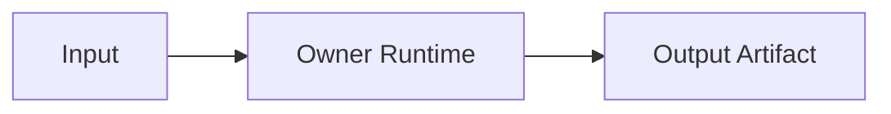

# Engineering Handoff Template

## Purpose

Use this template for a wave, domain, or cross-task handoff packet. It gives implementation agents and reviewers the context needed to execute a group of tasks without loading the entire repository.

## Handoff Metadata

| Field | Value |
|---|---|
| Handoff ID | `HANDOFF-<wave-or-domain>-<slug>` |
| Status | `DRAFT` / `READY_FOR_PLANNING` / `READY_FOR_SPRINT` / `SUPERSEDED` |
| Wave / domain | |
| Primary owner | |
| Supporting owners | |
| Included tasks | |
| Source authority | Active docs only |

## Target Outcome

Describe what must be true when this handoff is complete.

## Authority Packet

| Area | Active source |
|---|---|
| Product | |
| Architecture / ADR | |
| Specs | |
| Implementation | |
| UX / stories | |
| Traceability | |

## Execution Order

```text
Task A
-> Task B
-> Task C
```

## Architecture Context



## Runtime and Ownership

| Runtime / module | Responsibility | Non-responsibility |
|---|---|---|
| | | |

## Integration Map

| Contract | Owner | Producer | Consumer | Notes |
|---|---|---|---|---|
| API | | | | |
| Command | | | | |
| Event | | | | |
| Data | | | | |
| Audit | | | | |

## Data and State Ownership

| Entity / artifact | Owner | Mutability | Versioning |
|---|---|---|---|
| | | immutable / mutable / append-only | |

## Security, Privacy, and Audit

- PBAC:
- Tenant scope:
- Secrets:
- Raw source:
- Redaction:
- Audit:

## Risk Register

| Risk | Impact | Mitigation | Owner |
|---|---|---|---|
| | | | |

## Verification and Evidence

| Requirement | Evidence needed | Producing task |
|---|---|---|
| | | |

## Reviewers

| Reviewer boundary | Required? | Notes |
|---|---:|---|
| Product / requirements | | |
| Architecture / ADR | | |
| Backend API | | |
| Python worker | | |
| Security / PBAC | | |
| UX | | |
| Traceability | | |

## Exit Criteria

- 

## Open Decisions and Carry-Forward

| Decision | Status | Required before story ready? | Required before implementation readiness? |
|---|---|---:|---:|
| | | | |
