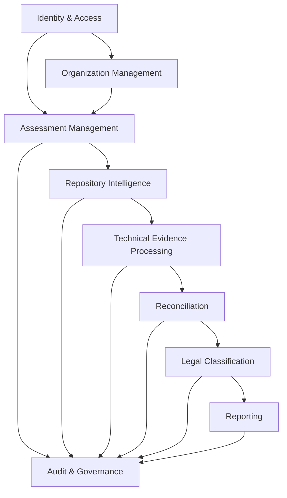

# LCSP Business Capability Map

## Purpose

This document shows what LCSP does at the business capability level. It is not an implementation guide, backlog, story map, or architecture rewrite.

## Capability Hierarchy

```text
LCSP
├── Identity & Access
├── Organization Management
├── Assessment Management
├── Repository Intelligence
├── Technical Evidence Processing
├── Reconciliation
├── Legal Classification
├── Reporting
└── Audit & Governance
```

## Capability Summary

| Capability | Purpose | Owner | Inputs | Outputs | Business Rules | Upstream Capabilities | Downstream Capabilities |
|---|---|---|---|---|---|---|---|
| Identity & Access | Authenticate users and enforce Manager/Developer authorization boundaries. | Backend API / Auth domain | User identity, OAuth/OIDC callback, session context, role membership | Authenticated session, authorization decision, audit event | BR-001..BR-013, BR-086..BR-094 | None | Organization Management, Assessment Management, Repository Intelligence |
| Organization Management | Keep users, organizations and membership boundaries scoped. | Backend API / Organization domain | User, organization, membership, role assignment | Organization, membership, Manager ownership context | BR-014..BR-017 | Identity & Access | Assessment Management |
| Assessment Management | Create and track assessments through the lifecycle. | Backend API / Assessment domain | Manager action, organization context, Wizard answers | Assessment, WizardProfile, assessment state | BR-018, BR-023..BR-031 | Identity & Access, Organization Management | Repository Intelligence, Reconciliation, Reporting |
| Repository Intelligence | Connect GitHub repository, pin snapshot and start repository scan. | Backend API + Scanner Worker | Repository connection, branch, commit, scan request | RepositoryConnection, RepositorySnapshot, ScanJob | BR-032, BR-077 | Assessment Management | Technical Evidence Processing |
| Technical Evidence Processing | Convert static repository scan output into evidence and technical profile objects. | Scanner / Technical Profile workers | RepositorySnapshot, ScanJob, SourceFile metadata, findings | TechnicalEvidenceReport, TechnicalFinding, TechnicalProfile | BR-036..BR-040, BR-080..BR-082 | Repository Intelligence | Reconciliation, Legal Classification |
| Reconciliation | Compare Manager declaration, TechnicalProfile and AIUsageFlow; pause for conflict resolution when needed. | Reconciliation worker + Backend API | WizardProfile, TechnicalProfile, AIUsageFlow, Manager resolution | Conflict, VerifiedProfile | BR-041..BR-048, BR-078, BR-083, BR-093 | Assessment Management, Technical Evidence Processing | Legal Classification |
| Legal Classification | Match verified usage to legal rules/citations and classify risk only when prerequisites pass. | Legal Matching Worker + Classification Worker | VerifiedProfile, AIUsageFlow, Legal Corpus Version, LegalRuleMatch | LegalRuleMatch, ClassificationResult | BR-049..BR-051, BR-082, BR-084 | Reconciliation | Reporting |
| Reporting | Generate gap analysis and documents under citation and conflict guardrails. | Gap Analysis / Document Worker | ClassificationResult, LegalRuleMatch, evidence refs, template version | GapAnalysis, GeneratedDocument | BR-062..BR-066, BR-079 | Legal Classification | Audit & Governance |
| Audit & Governance | Record material decisions, evidence references, artifact versions and blocked states. | Audit domain / all services | State changes, authorization decisions, evidence events, output events | AuditEvent, audit trail, version trace | BR-067..BR-070, BR-094 | All capabilities | Manager review, compliance dossier support |

## Capability Dependency Graph



## Capability Notes

### Identity & Access

- Purpose: establish user identity and enforce role boundaries.
- Owner: Backend API.
- Key outputs: session, role decision, authorization failure/success audit.
- Guardrail: OAuth/OIDC login does not grant repository access.

### Assessment Management

- Purpose: create the business context that makes technical evidence legally meaningful.
- Owner: Backend API and assessment state model.
- Key outputs: `Assessment`, `WizardProfile`, state transition.
- Guardrail: Wizard-only state cannot produce risk level.

### Repository Intelligence

- Purpose: create a commit-pinned evidence source without executing customer code.
- Owner: Backend API and Scanner Worker.
- Key outputs: `RepositoryConnection`, `RepositorySnapshot`, `ScanJob`.
- Guardrail: repository scan is static-analysis only and stores metadata, refs, hashes and paths.

### Technical Evidence Processing

- Purpose: transform repository facts into normalized evidence and technical profile.
- Owner: Scanner and Technical Profile workers.
- Key outputs: `TechnicalEvidenceReport`, `TechnicalFinding`, `TechnicalProfile`.
- Guardrail: provider/model/framework presence alone is not legal risk evidence.

### Reconciliation

- Purpose: align Manager-declared business truth with technical evidence and usage claims.
- Owner: Reconciliation worker and Manager conflict resolution API.
- Key outputs: `Conflict` or `VerifiedProfile`.
- Guardrail: unresolved conflict blocks classification and final report.

### Legal Classification

- Purpose: connect verified AI usage to citation-backed legal rules and classify risk.
- Owner: Legal Matching and Classification workers.
- Key outputs: `LegalRuleMatch`, `ClassificationResult`.
- Guardrail: classification requires VerifiedProfile and legal matching; missing citation blocks or degrades output.

### Reporting

- Purpose: produce gap analysis and documents from verified classification basis.
- Owner: Gap Analysis and Document workers.
- Key outputs: `GapAnalysis`, `GeneratedDocument`.
- Guardrail: final output must not overclaim legal certainty.

### Audit & Governance

- Purpose: make the workflow inspectable and accountable.
- Owner: all state-changing services write audit events.
- Key outputs: `AuditEvent`.
- Guardrail: audit records must not contain raw source, secrets, raw prompts or full AST bodies.
