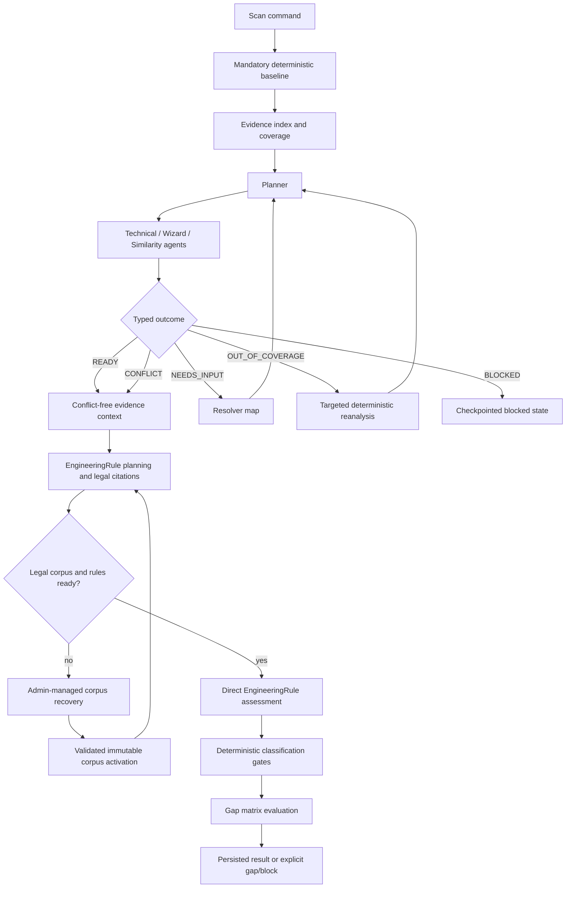

# Orchestration State Machine



## Agent outcome contract

```json
{
  "status": "NEEDS_INPUT",
  "missingInputs": [{
    "requirementId": "HUMAN_REVIEW_EVIDENCE",
    "subjectRef": "symbol:...",
    "requiredFor": "wizard.humanReview",
    "allowedResolvers": ["inspect_human_review_path", "trace_static_flow"],
    "priority": "HIGH"
  }],
  "coverageState": "SUFFICIENT",
  "evidenceRefs": ["ev:..."],
  "limitations": []
}
```

The orchestrator validates this schema, checks the resolver allow-list, budget, PBAC context, idempotency key, and checkpoint before invoking a resolver. It never interprets free-form agent prose as authority.
