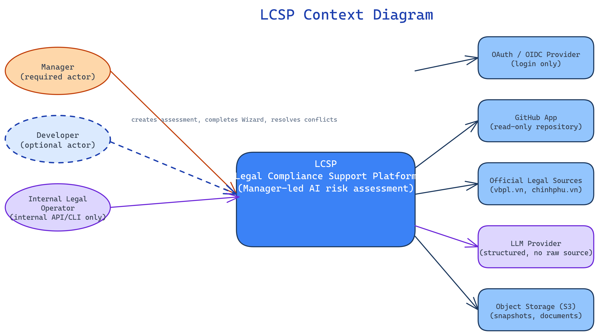
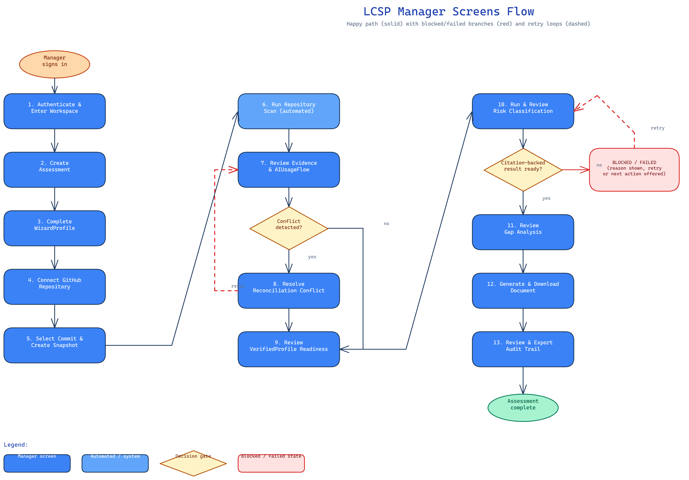

**Capstone Project Report**

**Report 3 – Software Requirement Specification**

– [Institution / Organization Logo] –

**Table of Contents**

[I. Project Report 3](#_Toc72138553)

[1. Status Report 3](#_Toc72138554)

[2. Team Involvements 3](#_Toc72138555)

[3. Issues/Suggestions 3](#_Toc72138556)

[II. Software Requirement Specification 4](#_Toc72138557)

[1. Overall Description 4](#_Toc72138558)

[1.1 Product Overview 4](#_Toc72138559)

[1.2 Business Rules 5](#_Toc72138560)

[2. User Requirements 6](#_Toc72138561)

[2.1 System Actors 6](#_Toc72138562)

[2.2 Use Cases 6](#_Toc72138563)

[3. Functional Requirements 8](#_Toc72138564)

[3.1 System Functional Overview 8](#_Toc72138565)

[3.2 <<Feature Name 1>> 10](#_Toc72138566)

[3.3 <<Feature Name 2>> 10](#_Toc72138567)

[4. Non-Functional Requirements 11](#_Toc72138568)

[4.1 External Interfaces 11](#_Toc72138569)

[4.2 Quality Attributes 12](#_Toc72138570)

[5. Other Requirements 14](#_Toc72138571)

[5.1 Appendix1 - Messages List 14](#_Toc72138572)

[5.2 Appendix2 - … 14](#_Toc72138573)

[5.3 … 14](#_Toc72138574)

# I. Project Report

## 1. Status Report

As of 2026-07-06, LCSP is in the **specification-complete, implementation-starting** stage: the full canonical baseline (56 Functional Requirements, 35 Non-Functional Requirements, 17 Use Cases, 95 Business Rules, and the corresponding domain model, architecture, and state-machine specs) is authored and internally consistent under Phase 5.2L/5.2M. `apps/api` (auth-workspace module) and a minimal `apps/web` scaffold exist; the remaining modules in Report 2's 7-phase schedule are not yet implemented (`IMPLEMENTATION_NOT_AUTHORIZED` had gated code work until specs were finalized).

## 2. Team Involvements

See Report 1 §1.2 (Project Team) and Report 2 §4 (Responsibility Assignments) for the current team roster and responsibility matrix. Specification authoring, architecture decisions, and this report set were produced collaboratively with AI-assisted tooling under direct team review and approval, per the project's documentation-first working method.

## 3. Issues/Suggestions

* The ChromaDB structure-first vectorless legal retrieval approach (ADR-026) is a deliberate departure from common dense-embedding RAG patterns; it requires the team to validate retrieval quality empirically once the legal corpus ingestion worker is implemented (Phase 5, Report 2).
* WizardProfile was downgraded from a mandatory gate to optional corroborating input mid-specification (Scanner-Primary/Wizard-Optional pivot); any legacy references to "Wizard is required before classification" found during implementation should be treated as stale and corrected against `docs/specs/ai-usage-flow-domain-spec.md`.

# II. Software Requirement Specification

## 1. Overall Description

### 1.1 Product Overview

LCSP (Legal Compliance Support Platform) replaces two weak existing approaches — self-declared compliance questionnaires and slow manual legal review — with a Manager-led, evidence-first pipeline: a Manager connects a read-only repository, the system runs an automatic trusted static scan, reconciles the resulting technical evidence with optional business context, and produces a citation-backed risk classification and guarded compliance document mapped to Vietnamese AI/data-protection law (Luật AI 134/2025 and related instruments). The system is expected to evolve in later releases to cover additional legal instruments and a broader scanner language surface; release 1.0 (this MVP) covers the full Manager golden path described below.

The context diagram below illustrates the external entities and system interfaces for release 1.0: the Manager and optional Developer as primary actors, the Internal Legal Operator as an internal-only actor, and five external systems (OAuth/OIDC Provider, GitHub App, Official Legal Sources, LLM Provider, Object Storage).

### 1.2 Business Rules

The full canonical business rule catalog (`BR-001`..`BR-095`) is maintained in `docs/product/business-rules.md`, organized into 17 categories (Account & Authentication, MFA, Organization & Membership, PBAC, Assessment Lifecycle, Wizard, Evidence Collection, Evidence Gates, Reconciliation, Scoring, Risk Classification, Legal Rule & Citation, Superseded Attestation Register, Security & Privacy, Report & Document, Audit Trail, Notification/Task). A representative subset is reproduced here; see §5.1 for the appendix excerpt and the source file for the complete, traceable set.

Key rules that most directly shape this SRS's functional requirements:

| ID | Rule Name | Rule Statement |
| --- | --- | --- |
| BR-018 | Manager assessment ownership | Manager is the accountable subject for business/legal truth; PBAC policy evaluation remains the authorization authority. |
| BR-023 | Assessment initial state | New assessment starts in `WIZARD_IN_PROGRESS`; Manager may proceed directly to repository connection without completing Wizard. |
| BR-032 | GitHub repository scan evidence path | MVP technical evidence must come from a read-only selected GitHub repository scan. |
| BR-041 | Conflict creation | When WizardProfile is linked, conflict is created on a mismatch; when not linked, no comparison runs (BR-095). |
| BR-049 | Classification after VerifiedProfile | Risk Classification may run only after VerifiedProfile exists and prerequisite gates pass. |
| BR-050 | Legal rule trace required | Critical classification outputs must trace to `rule_id`, legal source, citation, version, and effective date. |
| BR-051 | Unsupported legal conclusion blocked | Missing critical citation blocks final classification; no hallucinated legal basis is permitted. |
| BR-057 | No raw source to LLM | Raw source code must never be sent to the LLM Provider. |
| BR-095 | Technical-only verified profile path | Without a linked WizardProfile, VerifiedProfile is produced from technical evidence alone (`TECHNICAL_ONLY`), with business-dependent fields resolving `UNKNOWN` rather than blocking.

## 2. User Requirements

### 2.1 Actors

| **#** | **Actor** | **Description** |
| --- | --- | --- |
| 1 | Manager | Required, primary product actor. Owns the Assessment, resolves reconciliation conflicts, approves VerifiedProfile, and is the accountable subject for business/legal truth (BR-018). Can complete the entire golden path without Developer participation. |
| 2 | Developer | Optional, scoped collaborator. May be invited by the Manager for independently valuable technical tasks (e.g., reviewing redacted technical findings) under a PBAC policy scope; cannot approve VerifiedProfile, run final classification, or generate the final report. |
| 3 | Internal Legal Operator | Internal-only actor (API/CLI, not customer-facing UX). Validates legal sources, ingests and approves `LegalCorpusVersion`, and authors/approves `LegalRule`/`LegalRuleCatalogVersion`. |
| 4 | LCSP System (Backend API + Python Worker Platform) | Automated actor. Executes scans, generates TechnicalProfile/AIUsageFlow, performs legal matching, classification, gap analysis, and document generation asynchronously. |

### 2.2 Use Cases

#### 2.2.1 Diagram(s)

#### 2.2.2 Descriptions

| **ID** | **Use Case** | **Actors** | **Use Case Description** |
| --- | --- | --- | --- |
| UC-001 | Authenticate and Manage Account | Manager / Developer | Establish a safe organization-scoped session through approved password/MFA or OAuth/OIDC paths; invalid identity/session state is denied safely and audited. |
| UC-002 | Manage Organization and PBAC Policy Scope | Manager | Maintain tenant membership, PBAC policy scope, and optional scoped Developer collaboration. |
| UC-003 | Create Assessment | Manager | Create a Manager-owned Assessment in the organization. |
| UC-004 | Complete WizardProfile and Readiness | Manager | Optionally capture business/legal context in business language; shows readiness gaps, never a risk level. |
| UC-005 | Connect Repository | Manager (optional delegated Developer) | Connect a selected read-only GitHub repository through GitHub App, separate from login. |
| UC-006 | Create Repository Snapshot | Manager / System | Pin repository evidence to an immutable branch/commit snapshot. |
| UC-007 | Execute Repository Scan | Manager / System | Convert the snapshot into static technical evidence via the Python Scanner Worker. |
| UC-008 | Generate TechnicalProfile | System | Aggregate accepted evidence into evidence-backed technical dimensions or explicit unknowns. |
| UC-009 | Generate AIUsageFlow | System | Combine WizardProfile (if any), TechnicalProfile, and findings into claim-level usage facts with confidence. |
| UC-010 | Resolve Conflict | Manager | Resolve material mismatch between declared and detected facts while preserving scanner evidence. |
| UC-011 | Create and Approve VerifiedProfile | Manager / System | Produce the reconciled basis for legal matching once conflicts are absent or resolved. |
| UC-012 | Operate Legal Corpus and Perform Legal Matching | Internal Legal Operator / System | Prepare an approved immutable legal corpus and match VerifiedProfile facts to citation-backed rules. |
| UC-013 | Run Risk Classification | Manager / System | Create a cited risk result or explicit blocked state after VerifiedProfile and LegalRuleMatch. |
| UC-014 | Generate Gap Analysis and Documents | Manager / System | Derive compliance gaps and create a guarded final document (or an earlier readiness-only export). |
| UC-015 | Review and Export Audit Trail | Manager | Inspect and export redacted actor/action/object/version/correlation records. |
| UC-016 | Automatic Trusted Scan Initiation and Re-run Evidence | Manager / System | Create or resume a scan/evidence chain from a trusted integration context without mutating history. |
| UC-017 | Enforce Security and Privacy Controls | System | Enforce source non-execution, restricted workspace, cleanup, redaction, and fail-closed behavior. |

## 3. Functional Requirements

### 3.1 System Functional Overview

#### 3.1.1 Screens Flow

#### 3.1.2 Screen Descriptions

| **#** | **Feature** | **Screen** | **Description** |
| --- | --- | --- | --- |
| 1 | Account | Authenticate & Enter Workspace | Register/sign in, complete MFA if required, select organization, enter dashboard. |
| 2 | Assessment Setup | Create Assessment | Create a Manager-owned assessment with name/context. |
| 3 | Assessment Setup | Complete WizardProfile | Optional business-context questionnaire; shows readiness/gaps, never a risk level. |
| 4 | Assessment Setup | Connect GitHub Repository | Authorize and select a read-only repository/branch via GitHub App. |
| 5 | Assessment Setup | Select Commit & Create Snapshot | Pin the evidence source before scanning. |
| 6 | Technical Evidence | Run Repository Scan | Monitor automatic trusted scan status (queued/running/completed/failed) with safe reason codes. |
| 7 | Technical Evidence | Review Evidence & AIUsageFlow | Review detected AI usage, confidence, evidence refs, and limitations (redacted, no raw source). |
| 8 | Reconciliation | Resolve Reconciliation Conflict | Compare declared vs. detected values, inspect evidence, select resolution, enter rationale. |
| 9 | Reconciliation | Review VerifiedProfile Readiness | Confirm the reconciled basis is ready for legal matching. |
| 10 | Legal & Classification | Run & Review Risk Classification | Request/observe classification; review risk level, confidence, triggered rules, and citations, or a blocked/degraded reason. |
| 11 | Reporting | Review Gap Analysis | Review compliance gap items, priority, and obligation/citation refs. |
| 12 | Reporting | Generate & Download Document | Request generation, monitor status, preview metadata, download the guarded final report (or earlier readiness-only export). |
| 13 | Audit | Review & Export Audit Trail | Filter events, inspect actor/action/object/version/correlation/evidence refs, export allowed metadata. |

#### 3.1.3 Screen Authorization

| **Screen** | **Manager** | **Developer (scoped)** | **Internal Legal Operator** | **System** |
| --- | --- | --- | --- | --- |
| Authenticate & Enter Workspace | X | X |  |  |
| Manage Organization & PBAC Policy Scope | X |  |  |  |
| Create Assessment | X |  |  |  |
| Complete WizardProfile | X |  |  |  |
| Connect GitHub Repository | X | X (if delegated) |  |  |
| Run Repository Scan (view status) | X | X (if granted) |  | X (executes) |
| Review Evidence & AIUsageFlow | X | X (redacted, if granted) |  |  |
| Resolve Reconciliation Conflict | X |  |  |  |
| Review/Approve VerifiedProfile | X |  |  |  |
| Run & Review Risk Classification | X |  |  | X (executes) |
| Review Gap Analysis / Download Document | X |  |  | X (executes) |
| Review & Export Audit Trail | X |  |  |  |
| Legal Corpus Review / Approval (internal API/CLI) |  |  | X |  |

#### 3.1.4 Non-Screen Functions

| **#** | **Feature** | **System Function** | **Description** |
| --- | --- | --- | --- |
| 1 | Trusted Scan | `command.scan.requested.v1` / `event.scan.completed.v1` | Automatic trusted scan initiation and completion events (FR-050); no manual upload API exists. |
| 2 | Evidence Pipeline | Scanner toolchain job (Syft, Knip, deptry, `ast`/`libcst`, `ts-morph`, tree-sitter, Semgrep) | Async Python Scanner Worker job producing `TechnicalEvidenceReport` with verified workspace cleanup. |
| 3 | Legal Retrieval | ChromaDB structure-first retrieval (`retrieve(query, corpusVersion)`) | Structure-first, vectorless legal chunk retrieval with cross-reference expansion and citation allowlist. |
| 4 | Audit Writer | `AuditEvent` append-oriented writer | Persists material workflow/PBAC/evidence/classification/document events with correlation ID. |
| 5 | Outbox Publisher | `OutboxEvent` transactional messaging | Guarantees at-least-once delivery of domain events across the Queue Boundary. |

#### 3.1.5 Entity Relationship Diagram

**Entities Description**

| **#** | **Entity** | **Description** |
| --- | --- | --- |
| 1 | Organization | Tenant identity; owns memberships, assessments, and audit events. |
| 2 | Assessment | Manager-owned unit of work; carries the canonical lifecycle state. |
| 3 | WizardProfile | Optional Manager-declared business context (purpose, sector, data, oversight, external LLM usage). |
| 4 | RepositoryConnection / RepositorySnapshot | Read-only repository authorization and immutable commit-pinned snapshot. |
| 5 | RepositoryScanJob / TechnicalEvidenceReport | Scan execution record and its resulting metadata-only technical evidence. |
| 6 | TechnicalProfile | Evidence-backed technical summary derived from an accepted evidence report. |
| 7 | AIUsageFlow / AIUsageFlowClaim | Claim-level business usage facts with confidence and evidence references. |
| 8 | ReconciliationConflict | Material mismatch between declared and detected facts, pending Manager resolution. |
| 9 | VerifiedProfile | Immutable reconciled basis for legal matching (`TECHNICAL_ONLY` or `TECHNICAL_PLUS_WIZARD`). |
| 10 | LegalCorpusVersion / LegalRule / LegalRuleMatch | Approved legal corpus, hand-authored legal rules, and their citation-backed matches to a VerifiedProfile. |
| 11 | RiskClassification / GapAnalysis / GeneratedDocument | Citation-backed classification, derived compliance gaps, and the guarded final document. |
| 12 | AuditEvent | Append-oriented record of material actions across the whole pipeline. |

### 3.2 WizardProfile & Reconciliation

#### 3.2.1 Complete WizardProfile

* **Function trigger:** Manager opens the WizardProfile screen from the Assessment dashboard at any point in the assessment lifecycle (not gated before repository connection).
* **Function description:** Manager answers business-language questions covering purpose, sector, data categories, affected people, decision role, human oversight, and external LLM usage (BR-026, BR-027). Progress can be saved as a draft (BR-028); submission maps answers to structured fields (BR-029).
* **Function Details:** Wizard-only output shows a self-declared readiness state and gap checklist — it must never display a HIGH/MEDIUM/LOW risk label (BR-030). If the Manager skips the Wizard entirely, the assessment proceeds on the `TECHNICAL_ONLY` path (BR-095) with no penalty beyond lower confidence on business-declaration-dependent fields.

#### 3.2.2 Resolve Reconciliation Conflict

* **Function trigger:** Automatically presented to the Manager when the Reconciliation Worker detects a material mismatch between a linked WizardProfile and the technical evidence-derived AIUsageFlow (BR-041, BR-083).
* **Function description:** Manager compares declared vs. detected values side by side, inspects the underlying evidence references, selects a resolution, and enters a rationale. Manager is the sole required resolver (BR-042, BR-093); scanner evidence itself is immutable and cannot be overwritten by assertion (BR-047).
* **Function Details:** Submitting a resolution re-runs reconciliation; if no further conflicts exist, a `VerifiedProfile` is created (BR-045). If no WizardProfile was ever linked, this function does not apply — there is nothing to reconcile (BR-095), and the assessment proceeds directly once TechnicalProfile/AIUsageFlow confidence clears the required bar.

### 3.3 Legal Matching & Risk Classification

#### 3.3.1 Run & Review Risk Classification

* **Function trigger:** Automatically eligible once a `VerifiedProfile` exists and applicable `LegalRuleMatch` records are available (BR-049); Manager may also explicitly request a run from the Classification screen.
* **Function description:** The Classification Worker calls the LLM Gateway with the VerifiedProfile and matched legal rules (never raw source code, per BR-057) and requires every critical conclusion to carry a `rule_id`, citation, corpus version, and effective date (BR-050).
* **Function Details:** If a required citation is missing, the corpus version is unapproved, or usage is unknown/critical, the run is blocked or degraded with an explicit reason rather than guessed (BR-051, BR-082) — the UI must show the blocked/degraded state and next action, never an unsupported legal conclusion.

#### 3.3.2 Generate Gap Analysis and Document

* **Function trigger:** Automatically eligible once classification completes (or is explicitly degraded-eligible); Manager requests generation from the Reporting screen.
* **Function description:** Gap analysis derives structured compliance gaps, obligation references, and priorities from the classification and legal basis (BR-062). The final document additionally requires a resolved conflict state and full evidence/citation basis (BR-063, BR-064); a readiness-only export may be produced earlier but must never contain a risk level (BR-065).
* **Function Details:** Document status (pending/ready/blocked/failed) is always visible with a reason (BR-066); blocked states route back to the specific missing prerequisite (missing citation, unresolved conflict, insufficient evidence).

## 4. Non-Functional Requirements

### 4.1 External Interfaces

| Interface | Direction | Description |
| --- | --- | --- |
| OAuth / OIDC Provider | Inbound (login only) | Authenticates Manager/Developer identity; never grants repository access (NFR-005, NFR-006). |
| GitHub App | Outbound (read-only) | Repository selection, commit metadata, and read-only source access for scanning (NFR-007). |
| Official Legal Sources (vbpl.vn, chinhphu.vn) | Inbound (Internal Legal Operator only) | Source snapshot ingestion for the legal corpus (NFR-034). |
| LLM Provider | Outbound | Structured, sanitized prompts only for AIUsageFlow/classification/document generation; never raw source (NFR-012, NFR-033). |
| Object Storage (S3-compatible) | Outbound | Legal source snapshots and generated document artifacts. |

The full canonical Functional Requirement catalog (`FR-001`..`FR-056`) and Non-Functional Requirement catalog (`NFR-001`..`NFR-030`, `NFR-033`..`NFR-035`) are maintained in `docs/specs/functional-requirements.md` and `docs/specs/non-functional-requirements.md` respectively; every requirement referenced in this report traces to those canonical IDs.

### 4.2 Quality Attributes

#### 4.2.1 Usability

Wizard and blocked/locked states must use plain business language, not implementation terminology (NFR-028); a Manager with no code knowledge must be able to understand every readiness, blocked, or degraded state without training. Web forms and status messages meet common accessibility expectations, including keyboard navigation and labeled status messages (NFR-027).

#### 4.2.2 Reliability

Long-running scan, legal matching, classification, and document work must not depend on the web request lifecycle — job status and failure reason persist after the request completes (NFR-021). Re-runs preserve the historical evidence/profile/classification chain rather than mutating prior records (NFR-030); scanner workspace cleanup failure blocks downstream processing rather than silently continuing (NFR-035).

#### 4.2.3 Performance

MVP scan and worker operations are bounded by explicit file-size, timeout, CPU, memory, output, and retry policies (NFR-023); oversized or unsupported inputs produce explicit coverage-limitation or failed-job reasons rather than indefinite hangs. LLM API calls are protected by monthly cost budget boundaries and token usage caps (NFR-033).

#### 4.2.4 Security & Privacy

PBAC (policy-based access control) is the sole authorization source of truth and must be enforced at every UI/API/internal-API/worker command boundary, deny-by-default and fully auditable with policy ID/version (NFR-008). Raw source code, secrets, and full prompts must never reach an LLM provider or long-term persistence (NFR-012, NFR-013, NFR-015); every authorization decision and material workflow transition is audited (NFR-010, NFR-011).

## 5. Requirement Appendix

### 5.1 Appendix1 - Business Rules Excerpt

| ID | Rule Definition |
| --- | --- |
| BR-001 | Password-auth accounts must meet configured password strength policy. |
| BR-008 | MFA-enabled accounts must provide a valid Authenticator App OTP before session creation. |
| BR-018 | Manager is the accountable subject for business/legal truth; PBAC remains the authorization authority. |
| BR-023 | New assessment starts in `WIZARD_IN_PROGRESS`; Manager may connect a repository without completing Wizard. |
| BR-032 | MVP technical evidence must come from a read-only selected GitHub repository scan. |
| BR-041 | When WizardProfile is linked, a conflict is created on mismatch with technical evidence. |
| BR-045 | VerifiedProfile is created only after evidence is ready and conflicts are Manager-resolved. |
| BR-049 | Risk Classification may run only after VerifiedProfile exists and prerequisite gates pass. |
| BR-050 | Critical classification outputs must trace to rule ID, legal source, citation, version, and effective date. |
| BR-051 | Missing critical citation blocks final classification; no unsupported legal conclusion is permitted. |
| BR-057 | Raw source code must never be sent to the LLM Provider. |
| BR-063 | Final compliance report requires valid classification, gap analysis, evidence/rule trace, and no unresolved conflict. |
| BR-065 | Readiness-only export may be generated without technical evidence but must never include a risk level. |
| BR-082 | LCSP must not classify risk based only on AI model/provider/framework presence. |
| BR-095 | Without a linked WizardProfile, VerifiedProfile is produced from technical evidence alone (`TECHNICAL_ONLY`). |

The complete set (`BR-001`..`BR-095`) is in `docs/product/business-rules.md`.

### 5.2 Common Requirements

* Every authorization decision is tenant-scoped, deny-by-default, server-side enforced, versioned, auditable, and traceable to a policy ID/version plus correlation ID (NFR-008).
* Every material domain transition writes an `AuditEvent`; asynchronous transitions additionally use `OutboxEvent` for at-least-once delivery.
* No screen, API, or data model may reintroduce `FR-045`/`FR-046` (structured attestation), `FR-051` (manual evidence upload), or `FR-052` (delegated free-form clarification) without a separate, explicit Project Owner approval.

### 5.3 Application Messages List

| **#** | **Message code** | **Message Type** | **Context** | **Content** |
| --- | --- | --- | --- | --- |
| 1 | MSG01 | Toast message | Assessment created successfully | *Assessment created successfully.* |
| 2 | MSG02 | In red, under the field | Required Wizard field missing | *This field is required to continue.* |
| 3 | MSG03 | Inline banner | Repository scan queued | *Scan queued — this may take a few minutes.* |
| 4 | MSG04 | Inline banner (blocked) | Scan failed | *Scan failed: {safe\_reason\_code}. You can retry or re-scan.* |
| 5 | MSG05 | Inline banner (blocked) | Classification blocked | *Classification is blocked: {reason}. Resolve the listed item and try again.* |
| 6 | MSG06 | Toast message | Conflict resolved | *Conflict resolved — reconciliation will re-run.* |
| 7 | MSG07 | Inline banner | Document generation in progress | *Preparing your document — you'll be notified when it's ready.* |
| 8 | MSG08 | Toast message | Document ready | *Your document is ready to download.* |
| 9 | MSG09 | In red, under the field | Repository not selected | *Select a repository and branch to continue.* |

### 5.4 Other Requirements

None beyond the canonical `docs/specs/` baseline referenced throughout this report.
