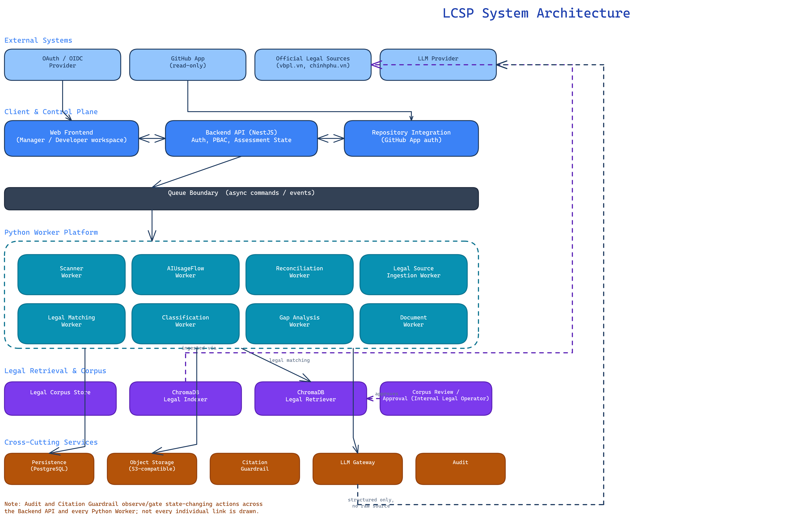
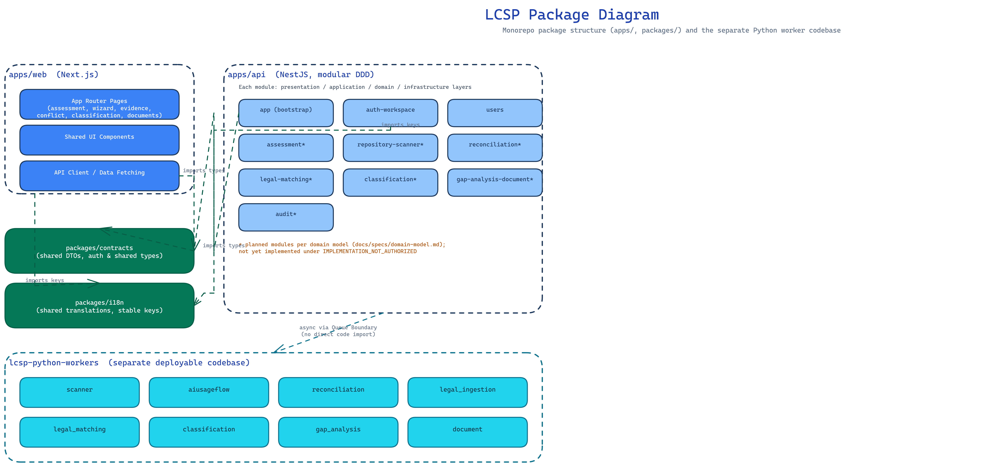
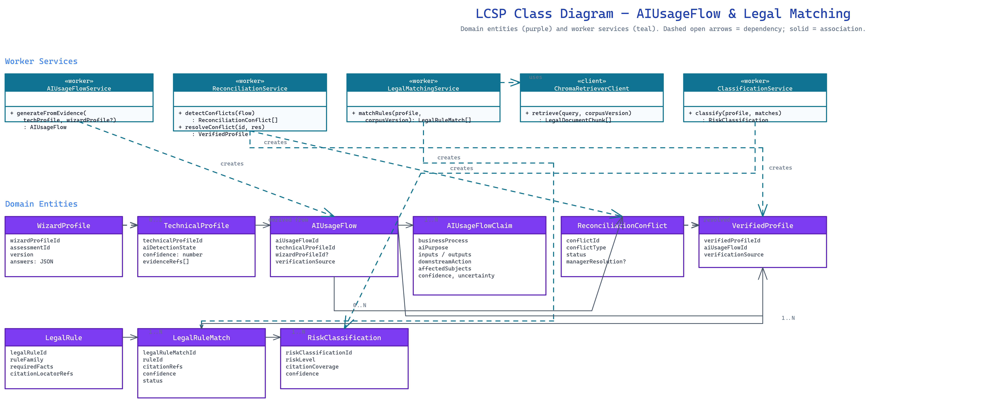

**Capstone Project Report**

**Report 4 – Software Design Document**

– [Institution / Organization Logo] –

**Table of Contents**

[I. Record of Changes 3](#_Toc83349083)

[II. Software Design Document 4](#_Toc83349084)

[1. System Design 4](#_Toc83349085)

[1.1 System Architecture 4](#_Toc83349086)

[1.2 Package Diagram 4](#_Toc83349087)

[2. Database Design 4](#_Toc83349088)

[3. Detailed Design 5](#_Toc83349089)

[3.1 <Feature/Function Name1> 5](#_Toc83349090)

[3.2 <Feature/Function Name2> 6](#_Toc83349091)

# I. Record of Changes

|  |  |  |  |
| --- | --- | --- | --- |
| Date | A\* M, D | In charge | Change Description |
| 2026-07-06 | A | Project Team | Initial authored version of Report 4, grounded in `docs/architecture/architecture.md` and `docs/specs/domain-model.md`. |
|  |  |  |  |
|  |  |  |  |

\*A - Added M - Modified D - Deleted

# II. Software Design Document

## 1. System Design

### 1.1 System Architecture

LCSP is a modular, evidence-first compliance platform, intentionally **gate-driven**: technical evidence, AIUsageFlow, reconciliation, VerifiedProfile, legal matching, classification, gap analysis, and document generation happen in strict sequence with explicit blocking conditions — each stage persists its output before the next stage runs, and hidden synchronous jumps across workflow gates are not allowed.

**Component descriptions:**

* **Web Frontend** — Manager/Developer workspace (Next.js) for assessment, repository connection, scan progress, conflict resolution, classification, and documents.
* **Backend API (NestJS)** — Synchronous control plane: authentication, PBAC enforcement boundary, assessment state, trusted-trigger creation, and async work creation.
* **Repository Integration** — Authorizes read-only GitHub repository access, kept separate from OAuth/OIDC login (NFR-006).
* **Queue Boundary** — Async command/event boundary between the Backend API and the Python Worker Platform; every stage persists before publishing its completion event.
* **Python Worker Platform** — Owns all asynchronous domain workloads through bounded consumers/modules (Scanner, AIUsageFlow, Reconciliation, Legal Source Ingestion, Legal Matching, Classification, Gap Analysis, Document), not a monolithic process.
* **Legal Corpus Store / ChromaDB Legal Indexer / ChromaDB Legal Retriever** — Structure-first, vectorless legal retrieval subsystem (ADR-026); preserves legal hierarchy (Điều/Khoản/Điểm) and expands cross-references one hop with a citation allowlist.
* **Corpus Review / Approval** — Internal Legal Operator gate; approves corpus and rule-catalog versions before they become usable for retrieval or classification.
* **Citation Guardrail** — Blocks or degrades legal matching, classification, and documents whenever a required citation or approved corpus basis is missing.
* **LLM Gateway** — Central model boundary for real provider calls, prompt/schema validation, retries, and privacy enforcement; mock mode is never acceptance evidence.
* **Audit** — Records state-changing and compliance-critical actions across all components without raw source, secrets, or full prompts.

### 1.2 Package Diagram

The codebase is organized as a monorepo (`apps/`, `packages/`) plus a separately deployable Python worker codebase (`lcsp-python-workers`). Each `apps/api` module follows a consistent presentation/application/domain/infrastructure layering (DDD-style).

***Package Descriptions***

|  |  |  |
| --- | --- | --- |
| **No** | **Package** | **Description** |
| 01 | `apps/web` | Next.js Manager/Developer workspace: App Router pages, shared UI components, API client. |
| 02 | `apps/api` | NestJS backend; modular DDD. Implemented: `app` (bootstrap), `auth-workspace`, `users`. Planned (per domain model, not yet implemented): `assessment`, `repository-scanner`, `reconciliation`, `legal-matching`, `classification`, `gap-analysis-document`, `audit`. |
| 03 | `packages/contracts` | Shared DTOs and auth/shared TypeScript types imported by both `apps/web` and `apps/api`. |
| 04 | `packages/i18n` | Shared translation keys imported by both `apps/web` and `apps/api`, ensuring stable-key blocked/error copy stays consistent across the boundary. |
| 05 | `lcsp-python-workers` | Separate deployable Python codebase: `scanner`, `aiusageflow`, `reconciliation`, `legal_ingestion`, `legal_matching`, `classification`, `gap_analysis`, `document` modules. Communicates with `apps/api` only asynchronously via the Queue Boundary — no direct code import across the language boundary. |

## 2. Database Design

The diagram below shows the core domain entities and their relationships, spanning identity/administration, assessment/repository, scanner evidence, intelligence/reconciliation, legal corpus/retrieval, and classification/reporting.

***Table Descriptions***

|  |  |  |
| --- | --- | --- |
| **No** | **Table** | **Description** |
| 01 | `Organization` | Tenant identity. - Primary key: `organizationId` |
| 02 | `User` / `OrganizationMembership` | User identity and tenant membership/role attribute. - Primary keys: `userId`, `membershipId` - Foreign keys: `organizationId`, `userId` |
| 03 | `Assessment` | Manager-owned unit of work; canonical lifecycle state. - Primary key: `assessmentId` - Foreign keys: `organizationId`, `ownerManagerId` |
| 04 | `WizardProfile` | Optional Manager-declared business context. - Primary key: `wizardProfileId` - Foreign key: `assessmentId` |
| 05 | `RepositoryConnection` / `RepositorySnapshot` | Read-only repository authorization and immutable commit-pinned snapshot. - Primary keys: `repositoryConnectionId`, `repositorySnapshotId` - Foreign keys: `assessmentId`, `repositoryConnectionId` |
| 06 | `RepositoryScanJob` / `TechnicalEvidenceReport` | Scan execution and resulting metadata-only evidence. - Primary keys: `scanJobId`, `technicalEvidenceReportId` - Foreign keys: `repositorySnapshotId`, `scanJobId` |
| 07 | `TechnicalProfile` | Evidence-backed technical summary. - Primary key: `technicalProfileId` - Foreign key: `technicalEvidenceReportId` |
| 08 | `AIUsageFlow` | Claim-level business usage facts. - Primary key: `aiUsageFlowId` - Foreign keys: `technicalProfileId`, `wizardProfileId` (optional) |
| 09 | `ReconciliationConflict` | Material mismatch pending Manager resolution. - Primary key: `conflictId` - Foreign key: `aiUsageFlowId` |
| 10 | `VerifiedProfile` | Immutable reconciled basis for legal matching. - Primary key: `verifiedProfileId` - Foreign key: `aiUsageFlowId` |
| 11 | `LegalCorpusVersion` / `LegalRule` / `LegalRuleMatch` | Approved legal corpus, hand-authored rules, and citation-backed matches. - Primary keys: `legalCorpusVersionId`, `legalRuleId`, `legalRuleMatchId` - Foreign keys: `verifiedProfileId`, `legalCorpusVersionId`, `ruleId` |
| 12 | `RiskClassification` / `GapAnalysis` / `GeneratedDocument` | Citation-backed classification, derived gaps, and guarded final document. - Primary keys: `riskClassificationId`, `gapAnalysisId`, `documentId` - Foreign keys: `legalRuleMatchId`, `riskClassificationId`, `gapAnalysisId` |
| 13 | `AuditEvent` | Append-oriented record of material actions. - Primary key: `auditEventId` - Foreign key: `organizationId` |

## 3. Detailed Design

### 3.1 AIUsageFlow & Legal Matching

This is the platform's core feature: turning static scanner evidence into a claim-level business usage record, reconciling it with optional declared context, and matching it to citation-backed legal rules.

#### 3.1.1 Class Diagram

**Class Specifications**

* **`AIUsageFlowService`** («worker») — `generateFromEvidence(techProfile, wizardProfile?): AIUsageFlow`. Combines technical evidence with optional Wizard context; sets `verificationSource` to `TECHNICAL_ONLY` or `TECHNICAL_PLUS_WIZARD`.
* **`ReconciliationService`** («worker») — `detectConflicts(flow): ReconciliationConflict[]`, `resolveConflict(id, resolution): VerifiedProfile`. Only produces conflicts when a WizardProfile is linked (BR-095); otherwise proceeds straight to VerifiedProfile creation.
* **`LegalMatchingService`** («worker») — `matchRules(profile, corpusVersion): LegalRuleMatch[]`. Delegates retrieval to `ChromaRetrieverClient` and applies the Citation Guardrail before returning matches.
* **`ChromaRetrieverClient`** («client») — `retrieve(query, corpusVersion): LegalDocumentChunk[]`. Structure-first, vectorless retrieval with cross-reference expansion.
* **`ClassificationService`** («worker») — `classify(profile, matches): RiskClassification`. Requires VerifiedProfile plus citation-backed matches; fails closed on missing citation or unknown critical usage.
* **`AIUsageFlow` / `AIUsageFlowClaim`** — domain entities carrying claim-level business process, purpose, inputs/outputs, downstream action, affected subjects, confidence, and uncertainty.
* **`ReconciliationConflict` / `VerifiedProfile`** — reconciliation outcome entities; `VerifiedProfile` is immutable once created and always carries its `verificationSource`.
* **`LegalRule` / `LegalRuleMatch` / `RiskClassification`** — legal basis and classification result entities, each carrying citation/confidence metadata.

#### 3.1.2 Sequence Diagram 1 — Repository Scan to TechnicalProfile / AIUsageFlow

This sequence shows the automatic trusted scan path (FR-050): a trusted trigger (Manager action or verified integration event) produces a `command.scan.requested.v1`, the Scanner Worker runs its static toolchain and persists a `TechnicalEvidenceReport`, and the AIUsageFlow Worker chains `TechnicalProfile` → `AIUsageFlow` generation before handing off to Reconciliation.

#### 3.1.3 Sequence Diagram 2 — Legal Matching to Classification to Document Generation

This sequence shows the legal-to-document orchestration (FR-032..FR-041): the Legal Matching Worker retrieves citation-backed rules through the ChromaDB Retriever under the Citation Guardrail, the Classification Worker calls the LLM Gateway with the VerifiedProfile and matches, and Gap Analysis / Document workers chain the remaining stages — each stage capable of ending in an explicit blocked state rather than an unsupported conclusion.

#### 3.1.4 …

No further sequence diagrams are required for this feature; the two diagrams above cover the full evidence-to-document pipeline referenced by other features in §3.2.

### 3.2 Scanner & Repository Evidence

The Scanner & Repository Evidence feature (UC-005..UC-007, UC-016, UC-017) shares its persistence model with §3.1's Entity Relationship Diagram (`RepositoryConnection`, `RepositorySnapshot`, `RepositoryScanJob`, `TechnicalEvidenceReport`) and its orchestration pattern with Sequence Diagram 1 in §3.1.2 — no separate class or sequence diagram is provided here; refer to those diagrams. Its distinguishing design element is the **sandboxed scanner workspace**: the Python Scanner Worker operates in a restricted, ephemeral workspace with pinned tool versions, bounded CPU/memory/timeout limits, no repository dependency installation, and no customer-application execution (NFR-035). Workspace cleanup is verified before a `COMPLETED` status is possible; cleanup failure blocks downstream processing rather than silently continuing.
